# Java笔记

## Table of Contents

[TOC]

## 1. Java 程序运行机制

Java程序要精波先编译，后解释两个步骤

> 编译型语言：使用专门的编译器，针对特定平台（操作系统）将某种高级语言源代码一次性“翻译”成可被该平台硬件执行的机器码（包括机器指令和操作数），并包装成该平台所能识别的可执行程序的格式，这个转换过程称为编译（Compile）。编译生成的可执行性程序可以脱离开发环境，在特定的平台上独立运行。
>
> *运行效率较高；通常无法移植到其他平台上运行*
>
> *C, C++等*
>
> 
>
> 解释型语言：使用专门的解释器对源程序逐行解释成特定平台的机器码并立即执行的语言。
>
> *不能脱离解释器独立运行；跨平台比较容易；效率比解释型语言低*
>
> *Ruby，Python等*

Java编译过成生成与平台无关的字节码（*.class 文件，非可执行性的，必须使用Java解释器来解释执行）

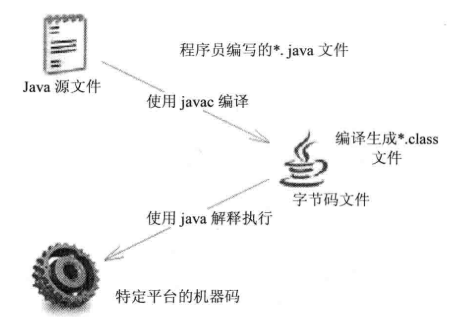

Java语言里负责解释执行字节码文件的事Java虚拟机（JVM）。不同平台上的JVM都是不同的，但是他们都提供了相同的接口。

> JVM：
>
> * 指令集
> * 寄存器
> * 类文件的格式
> * 栈
> * 垃圾回收堆
> * 存储区

Java中的一些文件夹

> bin：JDK的各种工具命令（如：javac，java等命令）
>
> db：安装JavaDB的路径
>
> include：一些平台特定的头文件
>
> jre：运行Java程序所必需的JRE环境
>
> lib：JDK工具命令实际执行程序
>
> javafx-src.zip：JavaFX核心类库源代码
>
> src.zip：Java核心类库源代码
>
> README, LICENSE等


## 2. 注释

单行注释：“//”

多行注释：“/\*”，"\*/"

文档注释：“/\**”，“\*/”


## 3. 标志符和关键字


#### 3.1 分隔符

1. 分号（“；“）：语句分隔。一个语句可以跨多行，最后以分号结束即可。
2. 花括号（“{}”）：定义代码块。成对出现。
3. 方括号（”[]“）：访问数组元素。
4. 圆括号（”（）“）：功能丰富。定义方法时形参声明；调用方法时传入实参；某部分括成整体；强制类型转换的运算符；...
5. 空格（“ ”）：分隔一条语句的不同部分。空格符（Space）、制表符（Tab）、回车（Enter）等。
6. 圆点（"."）：类/对象和它的成员（成员变量、方法和内部类）之间的分隔符，表明调用某个类或某个实例的指定成员。


#### 3.2 标识符规则

标志符就是用于给程序中变量、类、方法命名的符号。

> * 标识符可以由字母、数字、下划线（_）和美元符（$）组成，其中数字不能大头。
> * 标志符不能是Java关键字和保留字，但可以包含关键字和保留字。
> * 标识符不能包含空格。
> * 标识符只能包含美元符（$），不能包含@、#等其他特殊字符。


#### 3.3 Java关键字

Java所有关键字都是小写的。

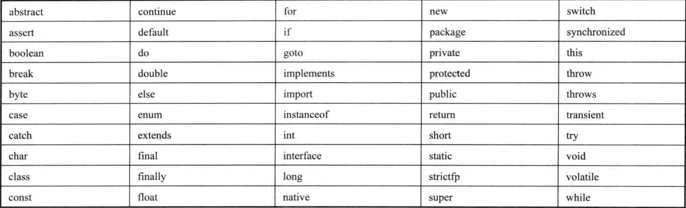


## 4. 数据类型


#### 4.1 Java中的类型

Java语言是强类型（strongly typed）语言。

> * 所有的变量必须先声明、后使用
> * 指定类型的变量只能接受类型与之匹配的值

type varName [ = 初始值];

Java语言支持的类型：

* 基本类型（Primitive Type）：

  * boolean类型

  * 数值类型：

    * 整数类型：byte, short, int, long, char

      > char代表字符型，字符型也是一种整数类型，相当于无符号整数类型

    * 浮点类型：float, double

* 引用类型：类、接口、和数组类型，还有一种特殊的null类型。

* 空类型（null type）：null值的类型。

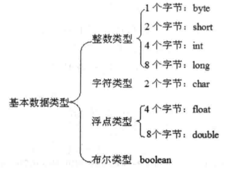

> 当使用一个巨大的整数值（超出int范围），	Java不会自动把这个整数值当成long，需要在数字后面加”L“或”l“，一般用”L“，避免混淆。

Java中整数值有四种表示方式：十进制，二进制，八进制，十六进制。二进制以0b或0B开头；八进制以0开头，十六进制以0x或0X开头。

Java默认浮点类型是double，如果希望Java把一个数当作float类型处理，应当在该浮点类型值后面紧跟f或F。

三个特殊浮点数值：正无穷大（Double或Float类 POSITIVE_INFINITY）、负无穷大（Double或Float类 NEGATIVE_INFINITY）和非数（Double或Float类 NaN），用于表示溢出和出错。所有正无穷大数值相等，所有负无穷大数值相等，NaN不与任何数值相等（与NaN也不相等）。

数值中可以使用下划线分隔。


#### 4.2 基本类型的类型转换

##### 4.2.1 自动类型转换

Java所有的数值型变量可以互相转换，如果系统支持把某种基本类型的值直接赋给另一种基本类型的变量，则这种方式被称为自动类型转换。当把一个表数范围小的数值或变量直接赋给另一个表数范围大的变量时，系统将可以惊醒自动类型转换，否则就需要强制转换。

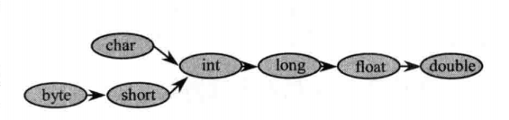

##### 4.2.2 强制类型转换

```java
//容易引起信息丢失
(targetType)value
```


#### 4.3 表达式类型的自动提升

当一个算术表达式中包含多个基本类型的值时，整个算术表达式的数据类型将发生自动提升。

* 所有的byte类型、short类型、和char类型将被提升到int类型
* 整个算数表达式的数据类型自动提升到与表达式中最高等级操作数同样的类型

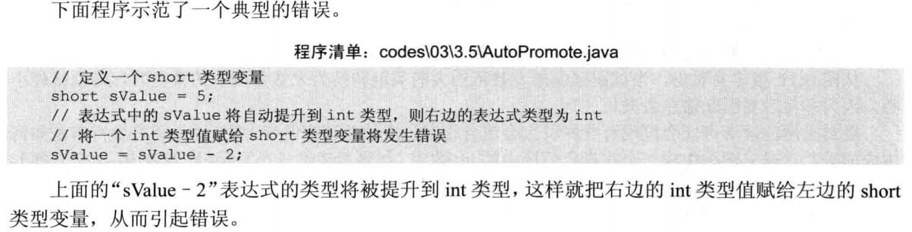


#### 4.4 直接量

直接量是指在程序中通过源代码直接给出的值。

直接量通常只有三种类型：基本类型、字符串类型和null类型

具体而言有以下8种：int, long, float, double, boolean, char, String, null


## 5. 运算符


#### 5.1 算数运算符

+，-， *，/，%（求余），++（自加），--（自减）

> 注：x += 5 和 x = x + 5的底层运行机制不同。见下例。

```java
byte a = 5;
//将int赋值给byte，报错
a = a + 5;
//下面语句不会报错
a += 5;
```


#### 5.2 赋值运算符

=

支持连续赋值

```java
int a;
int b;
int c;
a = b = c = 7;
```


#### 5.3 位运算符

* &：按位与。当两位同时为1时才返回1
* |：按位或。只要有一位为1即可返回1
* ^：按位异或。当两位相同时返回0，不同时返回1
* ~：按位非。单目运算符，将操作数的每个位（包括符号位）全部取反。
* <<，>>：左移/右移运算符
* \>>>：无符号右移运算符


#### 5.4 比较运算符

\>，\>=，<，<=，==，!=


#### 5.5 逻辑运算符

&&（短路与），&，||（短路或），|，！，^（异或，不相同时为true）


#### 5.6 三目运算符

"? :"

> (expression) ? if_true_statement : if_false_statement;


#### 5.7 运算符的结合性和优先级

（*上>下*）

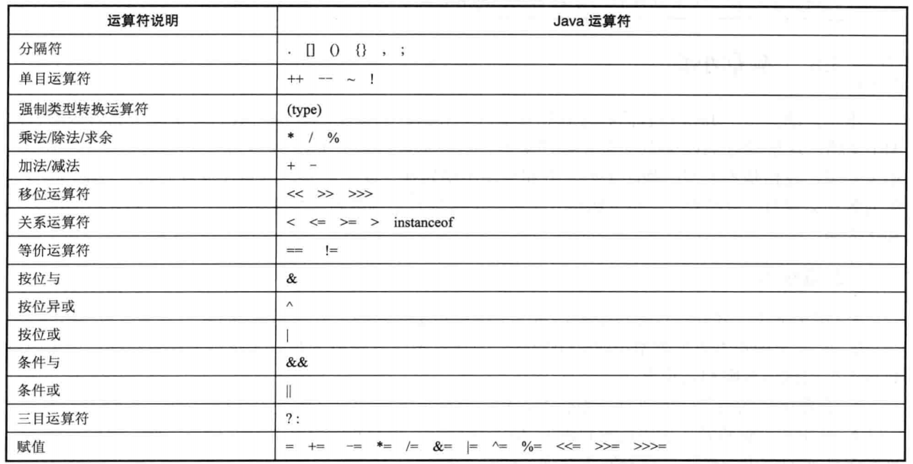


## 6. 流程控制


#### 6.1 顺序结构

从上到下逐行的执行


#### 6.2 分支结构

##### 6.2.1 if条件语句

```java
if (logic expression) {
    statement...
} else if { //可以有零个或多个else if语句
    staement...
} else {
    statement...
}

//代码块只有一行语句时，可以省略“{}”，多数情况下，最好不要省略花括号
if (logic expression)
    statement...;
else
    statement...;
```

##### 6.2.2 switch分支语句

```java
switch (expression) {
    case condition1:
        statement(s);
        break;
    case condition2:
        statement(s);
        break;
    default:
        statement(s);
}
```


#### 6.3 循环结构

##### 6.3.1 while循环语句

```java
[init_statement]
while (test_statement) {
    statement(s);
    [iteration_statement]
}
```

##### 6.3.2 do while循环语句

```java
//do while 循环至少会执行一次
[init_statement]
do {
    statement;
    [iteration_statement]
} while (test_expression);//必须要有这个分号
```

##### 6.3.4 for 循环

```java
for ([init_statement]; [test_expression]; [iteration_statement]) {
    statement(s);
}
```

##### 6.3.5 foreach循环

```java
for (type variableName : array | collection) {
    statement(s);
}
```


#### 6.4 嵌套循环

一个循环放到另一个循环体内，各种类型的循环都可以作为内/外层循环。


#### 6.5 控制循环结构

##### 6.5.1 使用break结束循环

break用于完全结束一个循环，跳出循环体。

break语句可以在其后紧跟一个标签（标识一个外层循环）来直接结束外层循环。

java中的标签就是一个紧跟着英文冒号（：）的标识符。与其他语言不同的是，Java中的标签放在循环语句前才有用。

 ```java
...
//外层循环，outer为标识符
outer:
for (int i = 0; i < 5; i++) {
    //内层循环
    for (int j = 0; j < 3; j++) {
        System.out.println("i的值为：" + i + ", j的值为：" + j);
        if (j == 1) {
            //跳出outer标签所标识的循环
            break outer;
        }
    }
}
 ```

##### 6.5.2 使用continue忽略本次循环剩下的语句

continue与break类似，continue会忽略本次循环剩下的语句，接着开始下一次循环。

continue也可以使用标签。

##### 6.5.3 使用return结束方法

return并不是专门用来结束循环的，它的功能是结束一个方法。

当return在循环体内时，并被执行到时，return语句会结束该方法，循环也自然而然结束。


## 7. 数组

Java的数组要求所有的数组元素具有相同的数据类型。

一旦数组的初始化完成，数组在内存中所占的空间将被固定下来，因此数组的长度不可变。即使某个数组数据清空，它所占的空间依然被保留。 


#### 7.1 定义数组

* type[] arrayName;
* type arrayName[];

*推荐使用第一种格式*


#### 7.2 初始化数组

Java的数组必须先初始化才能使用。

数组的初始化有两种方式：

> * 静态初始化：初始化时由程序员显式指定每个元素的初始值，由系统决定数组长度。

```java
arrayName = new type[]{element1, element2, element3, ...};
//简化静态初始化方法，只有在定义的同时初始化才能使用简化的静态初始化
type[] arrayName = {element1, element2,elements, ...};
```

> * 动态初始化：初始化时程序员只指定数组长度，由系统为数组元素分配初始值。

```java
arrayName = new type[length];
```

动态初始化的默认值:

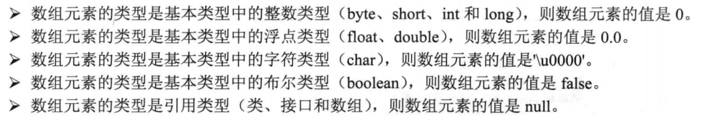


## 8. 理解面向对象概念


#### 8.1 面向对象的基本特征

封装(Encapsulation)：将对象的实现细节隐藏起来，然后通过一些公用方法来暴露该对象的功能

继承(Inheritance)：子类继承父类后，子类作为一种特殊的父类，将直接获得父类的属性和方法

多态(Polimorphism)：子类对象可以直接赋给父类变量，但运行时依然表现出子类的行为特征。同一个类型的对象在执行同一个方法时，可能表现出多种行为特征。

> 酒 a = 剑南春
>
> 酒 b = 五粮液
>
> 酒 c = 酒鬼酒

面向对象还支持如下几个功能：

> * 对象是面向对象方法中最几班的概念，它的基本特点有：标识唯一性，分类性，多态性，封装性，模块独立性好。
>
> * 类是具有共同属性，共同方法的一类事物。
> * 对象间的这种相互合作需要一个机制协助进行，这样的机制称为“消息”。
> * 在面向对象方法中，类之间共享属性和操作的机制称为继承。


#### 8.2 Java的面向对象特征

在Java中，除了8个基本数据类型值之外，一切都是对象。

类和对象：

* 具有相同或相似性质的一组对象的抽象就是类。类是对一类事物的描述，是抽象的，概念上的定义
* 对象是实际存在的该类事物的个体，也成为实例（instance）

类之间的结构关系：

* 一般$\rightarrow$特殊关系（extends）
* 整体$\rightarrow$部分结构关系（在一个类里保存另一个类的引用）


## 9. 面向对象


类（class）：抽象（引用类型）

实例（instance）：具体

类包含零个或多个构造器、成员变量、方法和初始化块(如果四种种成员都只定义零个，就是定义了一个空类，没有太大的实际意义)

定义类：

```java
[修饰符] class 类名 {
    零到多个构造器定义...
    零到多个成员变量...
    零到多个方法...
    零到多个初始化块...
}
```


#### 9.1 构造器

构造器是一个类创建对象的根本途径，如果一个类没有构造器，这个类通常无法创建实例。Java中，如果程序员没有为一个类编写构造器，则系统会为该类提供一个默认构造器。如果创建有构造器，则系统不再为该类提供构造器。

定义构造器

```java
[修饰符] 构造器名(形参列表) {
    //构造器执行体
}
```

修饰符：public/protected/private/省略

构造器名：必须与类名相同


#### 9.2 成员变量

定义成员变量

```java
[修饰符] 类型 成员变量名 [= 默认值]
```

修饰符：public/protected/private/省略 + static/省略 + final/省略


#### 9.3 方法

定义方法

```java
[修饰符] 返回值类型 方法名(形参列表) {
    //方法体
}
```

修饰符：public/protected/private/省略 + static/省略 + abstract/final/省略

> static是一个特殊的关键字，它修饰的成员表明该成员属于这个类本身，而不是属于这个类的单个实例。因此通常把static修饰的成员称为类变量，类方法。（或静态变量、静态方法）
>
> 不使用static修饰的普通方法、成员变量则属于该类的单个实例，而不属于该类。因此通常把不使用static修饰的成员变量和方法称为实例变量，实例方法。（或非静态变量、非静态方法）
>
> static修饰的方法和成员变量，既可通过类来调用，也可以通过实例来调用；没有使用static修饰的普通方法和成员变量，只可以通过实例来调用。静态成员不能直接访问非静态成员。


#### 9.4 初始化块

定义初始化块：

```java
[修饰符] {
    //初始化块的代码
}
```

初始化块的修饰符只能是static，使用static修饰的初始化块被称为静态初始化块。

* 非静态初始化块（构造代码块）

  优先于构造函数运行

  非静态初始化块给所有对象进行统一初始化，构造函数只给对应对象初始化。

  * 如过类只有一个构造器，无需使用非静态初始化块。如有多个构造器，可以将重复的工作写道非静态初始化块中
  * 可以应用在匿名内部类中，匿名内部类无法写构造方法，可以通过初始化块进行初始化工作

* 静态初始化块

  给类进行初始化。只执行一次

  与非静态初始化块的区别：

  * 无论创建几个对象，只执行一次
  * 优于非静态初始化块执行


#### 9.5 对象

创建对象

```java
//使用Person类定义一个Person类型的变量
Person person;
//通过new关键字调用Person类的构造器，返回一个Person实例
//将该Person实例传给person变量
person = new Person();

//简写
Person person = new Person();

//调用实例变量
person.name = "Zhang 3";
//调用方法
person.run();
```

**this方法**

*类似于python的self*

this关键字总是指向调用该方法的对象。

* 构造器中引用该构造器正在初始化的对象
* 在方法中引用调用该方法的对象

```java
public class Dog {
   
    public void jump() {
        System.out.println("Jump");
    }
    
    public void run() {
        this.jump();//可省略this
        jump();//实际上this依然存在
        System.out.println("Run");
    }
}
```

> static修饰的方法中不能使用this关键字


#### 9.6 方法的参数传递机制

Java中只有一种参数传递方式：值传递

> 详情见：
>
> https://www.zhihu.com/question/31203609/answer/576030121


#### 9.7 形参个数可变的方法

在定义方法时，在最后一个形参的类型后增加三点（...），则表明该形参可以接受多个参数值，多个参数值被当成数组传入。

```java
...
    public void test(String... books) {
		statements(s);
	}
...
```


#### 9.8 方法重载

方法名相同，形参列表不同，称为方法重载。


#### 9.9 变量

* 成员变量：
  * 实例变量
  * 类变量
* 局部变量
  * 形参
  * 方法局部变量
  * 代码块局部变量


#### 9.10 封装

将对象的状态信息隐藏在对象内部，不允许外部程序直接访问对象信息，而是通过该类所提供的方法来实现对内部信息的操作和访问。

* 隐藏类的实现细节
* 让使用者只能通过事先预定的方法来访问数据，从而可以在该方法里加入控制逻辑，限制对成员变量的不合理访问
* 可进行数据检查，从而有利于保证对象先抓扯的完整性
* 便于修改，提高代码的可维护性


#### 9.11 访问控制符

private $\rightarrow$ *default* $\rightarrow$ protected $\rightarrow$ public

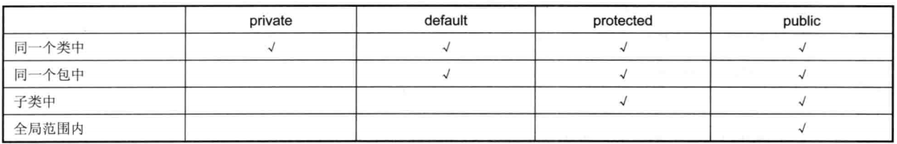


#### 9.12 继承

通过extends关键字实现，每个类只能有一个直接父类。

实现：

```java
[修饰符] class SubClass extends SuperClass {
    //...
}
```


#### 9.13 方法重写（Override）

“两同两小一大”规则：

* 两同：方法名相同、形参列表相同
* 两小：子类方法返回值类型应比父类方法返回值类型更小或相等，子类方法声明抛出的异常应比父类方法声明抛出的异常类更小或相等
* 一大：指的是子类方法的访问权限应比父类方法的访问权限更大或相等

（覆盖和被覆盖的方法，要么都是类方法，要么都是实例方法）

如果父类方法具有private访问权限，则该方法对其子类是隐藏的，即使子类中定义了具有相同方法名、相同的形参列表、相同的返回值类型的方法，依然不是重写。

*尽量不要在父类构造器中调用将要被子类重写的方法*


#### 9.14 super关键字

super用于限定对象调用它从父类继承得到的实例变量或方法

```java
class Person {
    public int age;
    public String name;
    
    public Person(int age, String name) {
        this.age = age;
        this.name = name;
    }
    
    public void eat() {
        System.out.println("吃！");
    }
}

public class Student extends Person {
    public String school;
    
    //通过super调用来调用父类构造器的初始化过程
    public Student(int age, String name, String school) {
        super(age, name);
        this.school = school;
    }
    
    //通过super来调用父类的方法
    public void eatFood() {
        super.eat();
    }
}
```


#### 9.15 多态

Java引用变量有两个类型，一个是编译时类型，一个是运行时类型。**编译时类型**由声明该变量时使用的类型决定，**运行时类型**由实际赋给该变量的对象决定。如果编译时类型和运行时类型不一致，就可能出现多态。

```java
class SuperClass {
    public int age = 11;
    
    public void base() {
        System.out.println("父类方法");
    }
    
    public void test() {
        System.out.println("父类被覆盖的方法");
    }
}

public class SubClass extends SuperClass {
    public String age = "十一";
    
    public void test() {
        System.out.println("子类的覆盖父类的方法");
    }
    
    public void sub() {
        System.out.println("子类方法");
    }
    
    public static void main(String[] args) {
        //此时编译时类型和运行时类型不一样，多态发生
        SuperClass s = new SubClass();
        
        //输出11，访问的是父类对象的实例变量
        System.out.println(s.age);
        
        //执行从父类继承的base()方法
        s.base();
        
        //执行子类的test()方法
        s.test();
        
        //报错，父类没有sub()方法
        //s.sub();
    }
}
```


#### 9.16 引用变量的强制类型转换

引用变量只能调用它编译时类型的方法，而不能调用它运行时类型的方法，即使它引用的对象包含这个方法（见上例）。如果需要让这个引用变量调用它运行时类型的方法，需要把它的类型强制转换成运行时类型。

强制转换方法：

```java
(type)variable
```

*在进行强制类型转换之前，先用* **instanceof** *运算符来判断是否可以转换*


#### 9.17 包装类


```java
//自动装箱
Integer i = 5;

//自动拆箱
int j = i;

//由于Java的缓存机制，-128~127的整数自动装箱时总是引用同一个对象
//Integer.valueOf可能会使用缓存对象
Integer m = new Integer(1);
Integer n = new Integer(1);
System.out.println(m == n);	//false
Integer p = Integer.valueOf(2);
Integer q = Integer.valueOf(2);
System.out.println(p == q);	//true
```

*缓存*

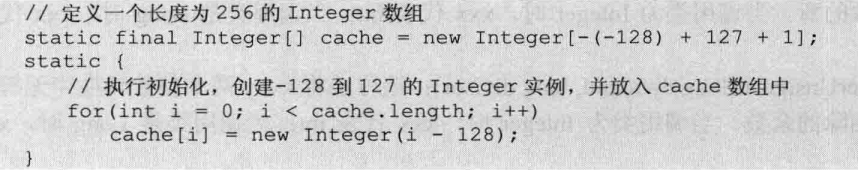

缓冲池中还包括：

* boolean values true and false
* all byte values
* short values -128~127
* int values -128~127
* char in the range \u0000 to \u007F

当使用字字符串直接量的时候，Java会将之保存到常量池中。所以如果在编译时能直接确认字符串，引用变量会引用同一个对象。

```java
String s1 = "你好Java";
String s2 = "你好";
String s3 = "Java";

String s4 = "你好" + "Java";
String s5 = "你" + "好" + "Java";

String s6 = s2 + s3;
String s7 = new String("你好Java");

System.out.println(s1 == s4);//true
System.out.println(s1 == s5);//true
System.out.println(s1 == s6);//false
System.out.println(s1 == s7);//false
```


#### 9.18 ==和equals方法

==：当比较的两个变量时基本数据类型，且都是数值类型，只要两个变量的值相等，就返回true。但是对于引用类型变量，只有他们指向同一个对象时，才会返回true

equals：String的equals()可以判断值是否相等。可以重写equals来使之符合需求

重写equals()方法应满足

* 自反性：对任意x，x.equals(x)一定返回true
* 对称性
* 传递性
* 一致性：对任意x，y，如果对象中用于比较的信息没有改变，无论调用多少次equals方法，返回值应一致
* 对任何不是null的x，x.equals(null)一定返回false

重写equals：

* 检查是否为同一个对象的引用，如果时返回true
* 检查是否为空，是返回false
* 检查是否是同一个类型，不是返回false
* 类型转换
* 判断关键元素


#### 9.19 单例（Singleton）类

只能创建一个对象的类被称为单例类

通过private构造器和创建实例的static方法实现

```java
class Singleton {
    private static Singleton instance;
    
    private Singleton() {}
    
    //此处必须是static方法，因为要通过这个方法来创建实例
    //实例还未被创建，所以不能使用实例方法，只能用类方法
    public static Singleton getInstance() {
        if (instance == null) {
            instance = new Singleton();
        }
        return instance;
    }
}
```


#### 9.20 final

修饰类、方法和变量，表示该类、方法或变量不可改变

##### 9.20.1 final成员变量

对于final修饰的成员变量，一旦有了初始值，就不能被重新赋值。如果既没有在定义成员变量时指定初始值，也没有在初始化块、构造器中为成员变量指定初始值，那么这些成员变量的值将一直是系统默认分配的0、'\u0000'、false或null。因此，Java规定，final修饰的成员变量必须由程序员显示的指定初始值。

* 类变量：必须在静态初始化块中或在声明该变量时指定初始值（二选一）
* 实例变量：必须在非静止初始化块、声明该实例变量或在构造器中指定初始值（三选一）

##### 9.20.2 final局部变量

系统不会对局部变量进行初始化，必须由程序员显式初始化。final局部变量可以在定义时指定默认值，也可以不指定默认值。


> **final修饰基本类型变量和引用类型变量的区别**
>
> final修饰基本变量类型时，不能对基本类型变量重新赋值，因此不能被改变。
>
> final修饰引用类型变量时，变量保存的只是一个引用，fianl修饰符保证该引用类型变量所引用的地址不变，但是这个对象本身可以发生改变。


##### 9.20.3 final方法

final方法修饰的方法不可被重写。

##### 9.20.4 final类

final修饰的类不可以有子类

##### 9.20.5 不可变类

不可变类在创建实例后，该实例的实例变量不可改变。

* 8个包装类
* java.lang.String

定义不可变类：

* 使用private和final修饰符来求实该类成员变量
* 提供带参数构造器，用于传参初始化类里的成员变量
* 仅为该类的成员变量提供getter方法，不提供setter方法。
* 如有必要，重写hashCode()和equals()方法。


#### 9.21 抽象类

* 抽象方法只有方法签名，无实现

* 有抽象方法的类只能被定义成抽象类，抽象类里面可以没有抽象方法

* 抽象类/方法必须用abstract修饰。抽象方法不能有方法体
* 抽象类无法被实例化
* final和abstract不能同时使用
* static和abstract不能同时修饰一个方法
* private和abstract不能同时修饰一个方法
* abstract不能用于修饰成员变量、局部变量和构造器


#### 9.22 接口

（*特殊的抽象类*）

接口里面所有的方法都是抽象方法

接口可以有多个直接父接口，但接口只能继承接口，不能继承类

实现：

```java
[修饰符] interface 接口名 extends 父接口1, 父接口2... {
    零到多个常量...
    零到多个抽象方法...
    零到多个内部类、接口、枚举...
    零到多个默认方法或类方法定义...
    
}
```

接口内不能包含构造器和初始化块定义

接口里的普通方法总是使用public abstract修饰

接口里的成员变量默认是使用public static final修饰的

一个类最多只能有一个直接父类，包括抽象类，但是可以实现多个接口


#### 9.23 内部类

定义在其他类内部的类称为内部类（又称嵌套类）。包含内部类的类称为外部类（又称宿主类）

* 内部类提供了更好的封装，可以把内部类隐藏在外部类之内，只在当前类生效
* 内部类可以直接访问外部类的私有数据，但外部类不能访问内部类的实现数据
* 内部类可以比外部类多使用三个修饰符：private、protected、static
* 非静态内部类不能拥有静态成员

```java
//在外部类以外使用非静态内部类
//非静态内部类的构造器必须使用外部类对象来调用
Out.In in = new Out().new In();
//在外部类以外使用静态内部类
//创建静态内部类对象时无须创建外部类对象
new OuterClass.InnerConstructor();
```

*父类的内部类在子类中不能重写。内部类的类名不是简单的由内部类的类名组成，它还把外部类的类名作为一个命名空间，作为限制。所以子类的内部类和父类的内部类不可能完全同名，也就不可能重写。*


#### 9.24 局部内部类

在方法中定义的内部类是局部内部类，该类仅在该方法中有效。

因为局部内部类不能在外部类的方法以外的地方使用，因此局部内部类也不能使用访问控制符和static修饰。


#### 9.25 匿名内部类

适用于只使用一次的类

定义匿名内部类：

```java
new 实现接口() | 父类构造器(实参列表) {
    //类体
}
```

匿名内部类必须继承一个父类，或实现一个接口（*只能一个*）

* 匿名内部类不能是抽象类。系统在创建匿名内部类时，会立即创建匿名内部类的对象，因此不允许将匿名内部类定义成抽象类
* 匿名内部类不能定义构造器。匿名内部类无类名，所以无法定义构造器，但是可以定义（实例）初始化块。


#### 9.26 Lambda表达式

主要用来代替匿名内部类的繁琐语法

它由三部分组成：

* 形参列表。允许省略形参类型。如果只有一个参数，甚至可以省略圆括号
* 箭头（->）
* 代码块。如果只包含一条语句，允许省略代码块花括号。只有一条return语句的Lambda的代码块，甚至可以省略return关键字，Lambda会自动返回这条语句的值。

实现：

```java
//不需要参数，返回1
() -> 1;

//接受一个参数，返回他的两倍
x -> 2 * x;

//接受两个参数，返回和
(x, y) -> x + y;

//接受两个int型整数，返回和
(int x, int y) -> x + y;

//接受String对象，并打印，不返回值
(String s) -> System.out.print(s);

//例子
//List.sort()和Collections.sort()
//其中Collections.sort()的定义为：
//public static <T> void sort(List<T> list, Comparator<? super T> c)
arrayList.sort((o1, o2) -> o2 - o1);
Collections.sort(yourList, (o1, o2) -> o2 - o1);

//可以使用Lambda表达式进行赋值
Runnable r = () -> {System.out.println("Hello world!")};
```

Lambda表达式的类型（也称为目标类型）必须是**函数式接口**

函数式接口只包含一个抽象方法的接口，可包含多个默认方法、类方法，但只能声明一个抽象方法

通过如下三种方式保证Lambda表达式的目标变量是一个明确的函数式接口：

* 将Lambda表达式赋值给函数式接口类型的变量
* 将Lambda表达式作为函数式接口类型的参数传给某个方法
* 使用函数式接口对Lambda表达式进行强制类型转换

同样的Lambda表达式可以被当成不同的目标类型，唯一的要求是Lambda表达式的形参列表与函数式接口中之一的抽象方法的形参列表相同

如果Lambda表达式的代码块只有一条代码，可以在代码块中使用**方法引用**和**构造器引用**

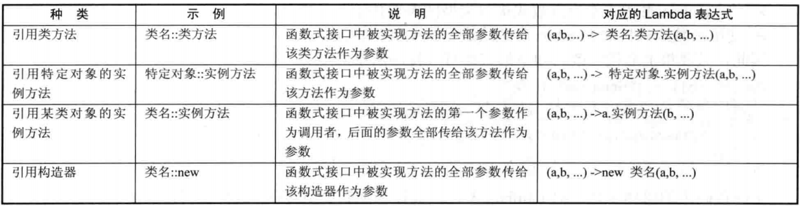


#### 9.27 枚举类

定义：

```java
[修饰符] enum 枚举类名称 {
    //常量
    //在第一行书写（第一个分号前），各个常量之间用逗号分隔
}
```

枚举类也是一种类，因此它也可以定义成员变量、方法和构造器。枚举类的实例**只能是枚举值**，而不是随意的通过new来创建枚举类对象。可以为枚举类增加实例变量，但是通过声明变量并为之创建相应的setter这种方法并不够好。枚举类通常应该设计成不可变类，也就是说他的成员变量不应该允许改变，因此建议将枚举类的成员变量都用private final修饰。

常用的方法是在构造器里为成员变量指定初始值。即为枚举类显式定义带参数的构造器。

```java
//一旦为枚举类显式定义了带参数的构造器，列出枚举值时就必须相对应的传入参数
public enum Gender {
    MALE("男"),FEMALE("女");
    private final String name;
    
    //枚举类的构造器只能使用private修饰
    private Gender(String name) {
        this.name = name;
    }
    
    public String getName() {
        return this.name;
    }
}
```


## 10. 泛型


#### 10.1 泛型

Java为了使集合有很好的通用性（可以保存各种各样类型的对象），将被保存对象视为Object类型，被保存对象的编译时类型变成Object（运行时类型没变）。

但是这样引发了一些问题：

* 保存的对象类型混杂。可能会引发异常
* 使用时需要强制类型转换。

为了解决这个问题，Java引入**参数化类型**的概念，在程序创建集合时指定集合中保存对象的类型。Java中的参数化类型被称为**泛型**（Generic）

```java
//集合类型<保存对象类型（类型实参）>
//只能保存String类型的List
List<String> books = new ArrayList<>();
```

当创建带泛型声明的接口或者父类的实现类或者子类时，接口、父类不能再包含类型形参（T，*或其他字母*），应为类型形参传入实际类型，见下例：

```java
//这样定义是错误的
// public class B extends A<T> {}

//应该这样定义
public class B extends A<String> {}

//也可以不传参
//Java编译器会发出警告：使用了未经检查或不安全的操作（泛型检查的警告）
public class B extends A {}
```

*不能在声明静态变量和静态方法的时候使用类型形参（T）*


#### 10.2 类型通配符

符号："?"

当集合形参的元素类型不确定的时候使用

```java
//使用List<?>表明List集合可以是任何泛型List的父类
public void test(List<?> c) {
    //...
}
```


#### 10.3 设定类型形参和类型通配符的上限

```java
//当只希望是某一类泛型List的父类时
//表示所有SupClass泛型List的父类，此处SupClass称为这个通配符的上限
public void test(List<? extends SupClass> varName) {}

//类型形参也可以设定上限
public class Apple<T extends Number> {}

//当需要设定多个上限时，用&符号
//至多一个父类上限，可有多个接口上限
//类必须在前
public class Apple<T extends Number & java.io.Serializable> {}

//也可以设定下限，使用super
//<? super ClassName>
```


#### 10.4 泛型方法

```java
修饰符 <T, S> 返回值类型 方法名(形参列表) {
    //...
}

//example
static <T> void test(Collection<T> from, Collection<T> to) {
    //...
}

static <T> void test(Collection<? extends T> from, Collection<T> to) {
    //...
}
```


#### 10.5 泛型方法和类型通配符的区别

大多数时候可以使用泛型方法来代替类型通配符

```java
//下面两种写法效果相同，第一个使用了类型通配符，第二个使用了泛型方法
public interface Collection<E> {
    boolean cotainsAll(Collection<?> c);
    boolean addAll(Collection<> extends E> c);
    ...
}

public interface Collection<E> {
    <T> boolean containsAll(Collection<T> c);
    <T extends E> boolean addAll(Collection<T> c);
    ...
}
```

在上面例子中，这两个方法的类型形参T只使用了一次。这种情况下，应该使用通配符，**通配符就是被设计用来支持灵活的子类化的**。

泛型方法允许类型参数被用来表示方法的一个或多个参数之间的**类型依赖关系**，或者方法返回值与参数之间的类型依赖关系。有这种类型以来关系时，应该使用泛型方法。

根据情况，也可以同时使用泛型方法和类型通配符。

Java中允许存在因泛型方法（通配符/上限/下限）不同而产生的方法重载。但是这样很有可能会产生问题（见下例）。

```java
//以下两个方法是可以同时存在在一个类中的。但是调用时会引起编译错误。
public static <T> void copy(Collection<T> from, Collection<? extends T> to) {
    //...
}

public static <T> void copy(Collection<? super T> from, Collection<? extends T> to) {
    //...
}

//当以以下方式调用copy()方法时
//既可以匹配第一种copy()方法（此时T的类型是Number）
//也可以匹配第二种copy()方法（此时T的类型是Integer）
List<Number> fromList = new ArrayList<>();
List<Integer> toList = new ArrayList<>();
copy(fromList, toList);
```


## 11. 异常处理

#### 11.1 try...catch捕获异常

```java
try {
    //statements;
    
//当catch括号中有多个异常类型时，不同异常类型使用"|"号隔开    
//捕获多异常时，异常变量默认有final修饰
} catch (Exception e) {
    //处理异常
}
```

如果执行try块里的代码出现异常，系统会自动生成一个异常对象，该异常对象被提交给Java运行环境，这个过程被称为**抛出**（throw）异常。

当Java运行环境收到异常对象时，会寻找能处理该异常对象的catch块，如果找到合适的catch块，则把该异常对象交给catch块处理，这个过程称为**捕获**（catch）异常。

如果找不到捕获异常的catch块，则运行时环境终止，Java程序也将退出。

#### 11.2 异常捕获流程

Java运行时环境接收到异常对象后，会依次判断该异常对象是否是catch块括号内的异常类或其子类的实例。如果是，Java运行时环境就会调用该catch块来处理该异常；否则继续将该异常对象和下一个catch块内的异常类比较。

如果异常对象被成功捕获，该异常对象会被传给catch块的括号内的异常形参，从而通过catch块处理该异常。异常被捕获后，后续的catch块不会被执行，因此，**通常**情况下，try...catch语句中只会执行至多一个catch语句。

#### 11.3 Java异常继承关系

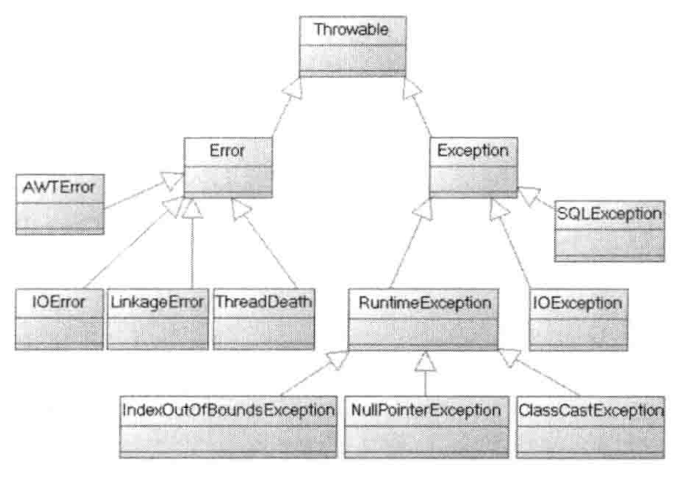

#### 11.4 访问异常信息

* getMessage()：返回该异常的详细描述字符串
* printStackTrace()：将该异常的跟踪栈信息输出到标准错误输出
* printStackTrace(PrintStream s)：将该异常的跟踪栈信息输出到指定输出流
* getStackTrace()：返回该异常的跟踪栈信息

#### 11.5 finally语句

try...catch语句中可以添加finally语句来回收资源（数据库链接、网络连接和磁盘文件等，这资源必须显式回收）。

> 不可以在try块中和或catch块中回收。当异常发生时，try当前语句后的语句将不会被执行，以造成资源不能回收；catch块中也可能无法被执行（如果没有异常发生，则catch块不会执行）。因此，需要在finally块中进行资源回收

```java
try {
    //...
} catch (Exception e) {
    //...
} finally {
    //资源回收
}
```

**一般情况下**，finally里的语句总是会执行，即使使用了return来停止方法。一般情况下，不要在finally块中使用return或throw等导致方法终止的语句。

> 当使用System.exit(1)语句直接退出虚拟机，finally语句不会被执行

一般情况下，不要在finally块中使用**return**或**throw**等导致方法终止的语句。

> 如果try或catch语句中有这样的语句，并且Java程序执行了这样的语句，方法不会直接结束，而是先执行finally块中的语句，再去执行return，throw等语句。如果finally语句中有这样的导致方法结束的语句，会影响方法的输出结果。

#### 11.6 自动关闭资源

即使有了finally语句，还是会发生忘记关闭资源的情况。所以，Java引入了自动关闭资源的try语句

```java
try (
	//声明、初始化需要显式关闭的资源
	//try语句会自动关闭这些资源
    ...) {
    //...
} catch (Exception e) {
    //...
} finally {
    //...
}
```

#### 11.7 处理Checked异常

Checked异常需要显式处理。处理方法有两种：

* 当前方法明确知道如何处理该异常，使用try...catch语句来捕获并处理异常
* 当前方法不知道如何处理这种异常，则在定义该方法的时候抛出异常

**使用throws声明抛出异常**

当前方法不知道如何处理某异常，该异常应该由上一级调用者处理。

> 如果main方法也不知道如何处理这种类型的异常，也可以用throws抛出，交给JVM处理（打印异常跟跟踪栈信息，并终止程序运行）

```java
public void test() throws ExceptionClass1, ExceptionClass2... {
    //...
}
```

要是一个方法的某段代码调用了带throws声明的方法，则需要将该段代码放到try...catch块中处理，或者将该方法也用throws声明。

#### 11.8 使用throw抛出异常

可以根据需求，使用throw关键字来自行抛出异常

```java
//throw抛出的是异常类的实例
throw ExceptionInstance;

//例子
throw new Exception("发成异常")；
```

如果throw语句抛出checked异常，则该throw语句要么处于try块中，要么放在一个带throws声明的方法中。

#### 11.9 自定义异常类

为了明确的描述异常情况，也可以自定义异常类。

自定义异常类都应该继承Exception类，或RuntimeException类

```java
public class CustomizeException extends Exception {
    public CustomizeException() {}
    public CustomizeException(String msg) {
        super(msg);
    }
}
```


## 12.  垃圾回收机制

Java的内存分配和回收都是由JRE在后台自动进行的。JRE会负责回收那些不再使用的内存，这种机制被称为垃圾回收（Garbage Collection，GC）。

> **特点**：
>
> * 只能回收内存资源（堆内存），对数据库，磁盘I/O等资源无能为力
> * 为了更快的让GC回收不再使用的对象，可以将该对象的引用变量设施为null
> * 不可预知性
> * 精准性：
>   1. 能够精准的标记活着的对象
>   2. 精准的定位对象之间的引用关系
>
> **好处**：
>
> * 提高编程效率
> * 保护程序的完整性
>
> **潜在缺点**：
>
> * 开销影响性能
