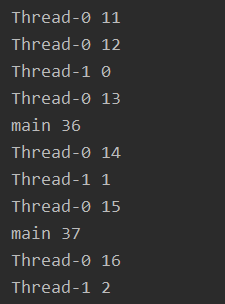
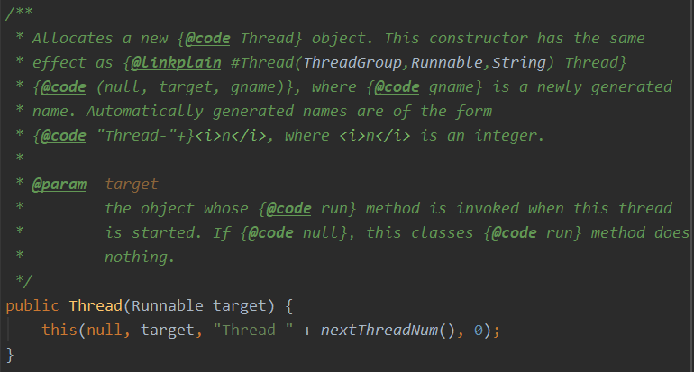
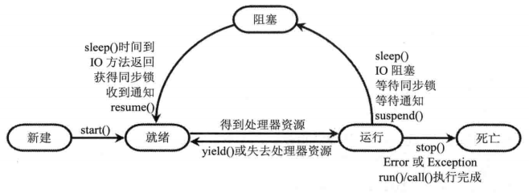

# Java 并发性与多线程编程

###### Ming Zhang


## 1. 线程简介

**线程**（thread）是操作系统能够进行运算调度的最小单位。大部分情况下，它被包含在*进程*之中，是*进程*中的实际运作单位。一条线程指的是进程中一个单一顺序的控制流，一个进程中可以并发多个线程，每条线程并行执行不同的任务。


#### 1.1 线程和进程

**进程**（Process）是处于运行过程中的程序，并且有一定的独立功能，进程是系统进行资源分配和调度的一个独立单位。

进程有如下三个特征：

* 独立性：进程是系统中独立存在的实体，它可以拥有自己独立的资源，每一个进程都拥有自己私有的地址空间。在没有经过进程本身允许的情况下，一个用户不可以直接访问其他进程的地址空间。
* 动态性：进程是一个正在系统中活动的指令集和（程序只是一个静态的指令集合）。进程具有自己的生命周期和各种不同的状态。
* 并发性：多个进程可以在单个处理器上并发执行，多个进程之间不会相互影响。

> 并发性（concurrency）和并行性（parallel）是两个概念。
>
> 并行是指在同一时刻，有多条指令在多个处理器上同时执行；
>
> 并发指在同一时刻只能有一条指令执行，但多个进程指令被快速轮换执行，使得在宏观上具有多个进程同时执行的效果。

一个程序运行后至少有一个**进程**；一个进程里可以包含多个**线程**，但至少要包含一个线程，每个线程互相独立。

> 当进程被初始化后，主线程就被创建了。
>
> 一个线程必须有一个父进程。线程可以拥有自己的堆栈、自己的程序计数器和自己的局部变量，但不拥有系统资源，它与父进程的其他线程共享该*进程*所拥有的全部资源。需要小心确保线程不会妨碍同一进程里的其他线程。


#### 1.2 多线程的优势

相比于多进程，使用多线程来实现并发比使用多进程的性能高得多。

* 进程之间不能共享内存，但线程之间共享内存非常容易
* 系统创建线程的代价比创建进程小得多（需要为该进程重新分配系统资源）
* Java内置多线程功能支持，简化了多线程编程


## 2. 线程的创建和启动

Java使用Thread类代表线程，所有线程对象都必须是Thread类或其子类的实例。


#### 2.1 通过继承Thread类创建线程类

> * 定义Thread类的子类，重写该类的run()方法，该run()方法的方法体代表了线程需要完成的任务。（*因此把run()方法称为线程执行体*）
> * 创建该类的实例，即创建类线程对象。
> * 调用线程对象的start()方法来启动该线程。

```java
//通过继承Thread类创建线程类
public class FirstThread extends Thread {
    private int i;
    
    //重写run()方法，run()方法的方法体就是执行体
    public void run() {
		for(; i < 100; i++) {
            //当线程类继承Thread类时，使用this可获取当前线程
            //使用getName()返回当前线程的名字
            System.out.println(getName() + " " + i);
        }       
    }
    
    public static void main(String[] args) {
        for (int i = 0; i < 100; i++) {
            //调用Thread类的currentThread()方法获取当前线程
            System.out.println(Thread.currentThread().getName()
                              + " " + i);
            if (i == 20) {
                //创建并启动线程
                new FirstThread().start();
                new FirstThread().start();
            }
        }
    }
}
```

>  (*output*)
>
> 

上面程序显式创建了2个线程，但是实际上程序中有3个线程——程序<u>显式创建的2个线程</u>和<u>主线程</u>。当Java程序开始运行后，程序至少会创建一个主线程，该主线程的执行体不是由run()确定的，而是由main()方法确定的，<u>main()方法的方法体代表主线程的线程执行体</u>。


#### 2.2 通过实现Runnable接口创建线程类

> * 定义Runnable接口的实现类，并重写该接口的run()方法
> * 创建该实现类的实例，以此实例作为Thread的target来创建Thread对象，该对象为线程对象



*（Java源码）*

```java
//创建Runnable实现类的对象
SecondThread st = new SecondThread();
//以Runnable实现类的对象作为Thread的target来创建Thread对象，即线程对象
new Thread(st);

//当通过实现Runnable接口来创建线程类时
//只能用Thread.currentThread()方法来获取当前线程
```

> Runnable接口只包含一个抽象方法，并使用了@FunctionalInterface修饰。即Runnable接口是函数式接口，可以使用Lambda表达式创建Runnable对象。（见下例）

```java
new Thread(() -> {
            for (int i = 0; i < 10; i++) System.out.println(Thread.currentThread().getName() + " " + i);
            }, "new Thread").start();
```


#### 2.3 使用Callable和Future创建线程

Java中的Callable接口提供了call()方法可以作为线程执行体

* call()方法可以有返回值
* call()方法可以声明抛出异常

但是不能直接使用Callable对象作为Thread的target（*Callable并不是Runnable的子接口*），Java使用FutureTask类来包装Callable接口从而创建线程（*FutureTask实现了Future接口和Runnable接口，因此可以作为Thread的target*）。

> 创建步骤：
>
> * 创建Callable接口的实现类，并实现call()方法 。再创建Callable实现类的实例。（*Callable接口也是函数式接口，所以可以使用Lambda表达式创建Callable对象*）
> * 使用FutureTask类包装Callable对象。
> * 使用FutureTask对象作为Thread对象的target创建并启动新线程
> * 使用FutureTask对象的get()方法来获得子线程执行结束后的返回值

```java
public class ThirdThread {
    public static void main(String[] args) {
        //使用Lambda创建Callable<Integer>对象
        //并使用FutureTask包装该对象
        FutureTask<Integer> task = new FutureTask<>(() -> {
            int i = 0;
            for (; i < 100; i++) {
                System.out.println(Thread.currentThread().getName()
                        + ": " + i);
            }
            return i;
        });

        for (int i = 0; i < 100; i++) {
            System.out.println(Thread.currentThread().getName()
                    + ": " + i);
            if (i == 20) {
                new Thread(task, "有返回值的线程").start();
            }
        }

        try {
            System.out.println("返回值: " + task.get());
        } catch (Exception e) {
            e.printStackTrace();
        }
    }
}

//使用get()方法来返回call()的返回值时，会导致主线程被阻塞
//直到call()方法结束并返回为止
```

实现Callable接口和实现Runnable接口没有太大区别，只是Callable的call()方法允许声明抛出异常，而且允许带返回值


#### 3.4 三种方式对比

采用实现Runnable、Callable接口的方式创建多线程的优缺点：

* 线程类还可以继承其他类
* 多种线程可以共享同一个target对象。适合多个相同线程来处理一份资源的情况。从而可以将CPU、代码和数据分开，形成清晰的模型。
* 编程稍复杂

采用继承Thread类的方式创建多线程的优缺点：

* 不能再继承其他父类
* 编写简单

因此，一般推荐采用实现Runnable接口、Callable接口的方式来创建多线程。


## 3. 线程的生命周期

当线程被创建并启动后，它并不会直接进入执行状态，也不是一直处于执行状态。在线程的生命周期中，他要经历新建（New）、就绪（Runnable）、运行（Running）、阻塞（Blocked）和死亡（Dead）5种状态。线程启动后会在运行和阻塞之间多次切换（不能一直占用CPU独自运行）。


#### 3.1 新建（New）和就绪（Runnable）

**新建**（New）：当程序使用new关键字创建了一个线程后，该线程就处于新建状态，此时它和其他的Java对象一样（*Java虚拟机为其分配内存，并初始化其成员变量的值*）。

**就绪**（Runnable）：当程序调用了start()方法之后，该线程就处于就绪状态（*Java虚拟机会为其创建方法调用栈和程序计数器，处于这个状态中的线程并没有开始运行，只是表示该线程可以运行了*）。

> 使用start()方法来启动线程！
>
> 如果调用run()方法，系统会把线程对象当成一个普通对象，run()方法会立即执行，并且在run()方法结束之前其他线程无法并发执行。并且，调用了run()方法之后，该方法不再处于新建状态，此时无法再调用线程的start()方法（*只能对处于新建状态的线程对象调用start()方法*）。


#### 3.2 运行（Running）和阻塞（Blocked）状态

**运行**（Running）：当处于就绪（Runnable）的线程获得了CPU，开始执行run()方法的线程执行体，则该程序处于运行状态。

> * 在一个CPU中，任何时刻只有一个线程属于运行状态。多个线程在同一个CPU上轮换执行。
>
> * 在多处理器的机器上，将会有多个线程**并行**。
>
> * 当线程数大于处理器数时，依然会出现多个线程在同一个CPU上轮换执行。

**阻塞**（Blocked）：为了使其他线程获得执行的机会，线程在运行过程中会被中断（*除非线程足够短，瞬间执行结束*），此时称该线程被阻塞（Blocked）。（*线程调度的细节取决于底层平台所采用的策略*）

> 多任务处理方式：
>
> 1. 抢占式多任务处理（Preemption）：操作系统完全决定进程调度方案。操作系统给每个可执行线程一个小时间段来处理任务，时间段结束后，系统会剥夺该线程所占用的资源，让其他线程运行。选择下一个线程时，系统会考虑线程的优先级。
>    * 每个任务赋予唯一的一个优先级（有些操作系统可以动态的改变任务的优先级）
>    * 优先执行优先级高的任务
> 2. 协作式式多任务处理（Cooperative Multitasking）：下一个进程调度的前提是当前进程主动放弃所占用的资源。

当发生如下情况时，线程将会进入阻塞状态：

* 线程调用sleep()方法主动放弃所占用的处理器资源
* 线程调用了一个阻塞式IO方法，在该方法返回之前，该线程被阻塞
* 线程试图获得一个同步监视器，但该同步监视器正被其他线程所持有
* 线程正在等待某个通知（notify）
* 程序调用了线程的suspend()方法将该线程挂起（*容易导致死锁，应避免使用*）

被阻塞的线程会在以先特定情况时解除，使该线程重新进入**就绪**状态：

* 调用sleep()方法的线程经过了特定时间
* 线程调用的阻塞式IO方法已经返回
* 线程成功的获得了试图取得的同步监视器
* 线程正在等待某个通知时，其他线程发出了一个通知
* 处于挂起状态的线程被调用了resume()恢复方法




#### 3.3 线程死亡

线程会以如下三种方式结束，结束后就处于死亡状态：

* run()或call()方法执行完成，线程正常结束
* 线程抛出一个未捕获的Exception或Error
* 直接调用该线程的stop()方法来结束该线程（容易死锁，通常不推荐使用）

> 可用isAlive()方法判断线程是否已经死亡。当线程处于就绪、运行、阻塞三种状态时，该方法将返回true；当线程处于新建、死亡两种状态时，该方法返回false
>
> 已经死亡的线程不可用start()方法重新启动


## 4 控制线程


#### 4.1 join线程

当在某个程序执行流（<u>主</u>）中调用其他线程（*次*）的join()方法时，调用线程（<u>主</u>）将被阻塞，直到join()方法加入的join线程（*次*）执行完为止。

> join()方法通常由使用线程的程序调用，以将大问题划分成许多小问题，每个小问题分配一个线程。所有小问题处理后，在调用主线程来进一步操作。

```java
public class JoinThread extends Thread {
    public JoinThread(String name) {
        super(name);
    }

    public void run() {
        for (int i = 0; i < 100; i++) {
            System.out.println(getName() + " " + i);
        }
    }

    public static void main(String[] args) throws InterruptedException {
        //启动子线程1
        new JoinThread("New Thread").start();
        for (int i = 0; i < 100; i++){
            if (i == 20) {
                //main线程调用了jt线程的join()方法
                //main线程必须等jt线程执行结束才会向下执行
                //子线程1不受影响
                JoinThread jt = new JoinThread("Joined New Thread");
                jt.start();
                jt.join();
            }
            System.out.println(Thread.currentThread().getName() + " " + i);
        }
    }
}
```


#### 4.2 后台线程

后台线程（Daemon Thread）：后台运行，为其他的线程提供服务。又称守护线程或精灵线程，如JVM的垃圾回收线程。

所有前台线程死亡，后台线程会自动死亡。

```java
public class DaemonThread extends Thread {
    public void run() {
        for (int i = 0; i < 1000; i++) {
            System.out.println(getName() + " " + i);
        }
    }

    public static void main(String[] args) {
        DaemonThread daemonThread = new DaemonThread();
        //调用setDaemon()方法将线程设置成后台线程
        daemonThread.setDaemon(true);
        daemonThread.start();
        for (int i = 0; i < 10; i++) {
            System.out.println(Thread.currentThread().getName() + " " + i);
        }
        //程序结束，前台线程（main线程）结束
        //后台线程随之结束
    }
}
```


#### 4.3 线程睡眠

线程睡眠：让当前<u>正在执行</u>的线程暂停一段时间，并进入**阻塞**状态。睡眠期间，被睡眠的线程不会获得执行的机会，即使没有其他可执行的线程。

```java
public class SleepThread {
    public static void main(String[] args) throws InterruptedException {
        for (int i = 0; i < 10; i++) {
            System.out.println("Time" + new Date());
            //使用sleep()方法让当前线程暂停1s
            Thread.sleep(1000);
        }
    }
}
```


#### 4.4 线程让步

线程让步：让当前正在执行的线程暂停，但不会阻塞该线程，只是将该线程转入**就绪**状态。

> 当某个线程调用了yield()方法暂停之后，只有<u>优先级与当前线程相同</u>，或者<u>优先级比当前线程更高</u>的<u>处于就绪状态的线程</u>才会获得执行的机会。

```java
public class YieldThread extends Thread {
    public YieldThread(String name) {
        super(name);
    }

    public void run() {
        for (int i = 0; i < 50; i++) {
            System.out.println(getName() + " " + i);
            if (i == 20) {
                Thread.yield();
            }
        }
    }
	
    //在多CPU并行的环境下，yield()方法的功能有时不明显
    //通常不建议使用yield()方法控制并发线程的执行
    public static void main(String[] args) {       
        YieldThread yt1 = new YieldThread("高级");
        //将yt1的优先级设为最高
        yt1.setPriority(Thread.MAX_PRIORITY);
        yt1.start();

        YieldThread yt2 = new YieldThread("低级");
        //将yt2的优先级设为最低
        yt2.setPriority(Thread.MIN_PRIORITY);
        yt2.start();
    }
}
```


#### 4.5 改变线程优先级

每个线程具有优先级，优先级较高的线程获得较多的执行机会，优先级较低的线程获得较少的执行机会。

每个线程默认优先级与他的父线程优先级相同。默认情况下，main线程具有普通优先级。

方法：setPriority(int newPriority)，getPriority()

> setPriority()方法的参数在1~10之间
>
> 也可以使用Thread类的静态常量
>
> * MAX_PRIORITY: 10
> * MIN_PRIORITY: 1
> * NORM_PRIORITY: 5
>
> *尽量使用静态常量来设置优先值，以确保可移植性*


## 5. 线程同步


#### 5.1 线程安全问题

当程序中有变量的<u>读取</u>、<u>写入</u>或<u>判断</u>操作时，可能会引起线程不安全。

> 例：假如往一个列表中存放数据时分为两步：
>
> 1. 在第n个位置存放元素
> 2. 增大n的值
>
> 假如此时有两个线程A和B往一个列表中存放数据，n的初始值为0。A先将数据存放到位置n=0。但是这个时候线程A被暂停，线程B开始运行。因为此时n的值还是0（由于A被中断，n的值并未增加），所以B也把元素存放到了位置n=0。然后，A和B继续执行完毕，结束时n=2。此时线程就不安全了，列表中只有一个值但是n却等于2。

线程安全问题都是由**全局变量**和**静态变量**引起的。

一般来说，如果每个线程中只对全局变量和静态变量有读操作，而无写操作，线程是安全的。如果多个线程同时执行写操作，就可能影响线程安全。


#### 5.2 解决线程安全问题

##### 5.2.1 同步代码块

为了解决线程安全问题，Java引入**同步监视器**来解决这个问题。使用同步监视器的通用方法是同步代码块。语法如下：

```java
//括号中的obj即同步监视器
synchronized(obj) {
    //...
}
```

上面代码的含义是：线程开始执行同步代码块之前，必须先获得对同步监视器的锁定。

任何时刻只能有一个线程可以获得对某个同步监视器的锁定，当同步代码块执行完成后，该线程会释放对该同步监视器的锁定。

任何对象都可以作为同步监视器。通常推荐使用**可能被并发访问的共享资源**作为同步监视器（*例如上例中，列表可以作为同步监视器*）。

##### 5.2.2 同步方法

使用**synchronized**关键字修饰的方法称为同步方法。同步方法的同步监视器是this，也就是调用该方法的对象。

```java
public synchronized 返回值类型 方法名() {...}
```


通过使用同步方法可以非常方便的实现线程安全的类，线程安全的类有如下特征：

* 该类的对象可以被多个线程安全的访问
* 每个线程调用该对象的任意方法之后都将得到正确结果
* 每个线程调用该对象的任意方法之后，该对象状态依然保持合理状态

> 不可变类总是线程安全的，因为它的对象状态不可改变

线程安全是以降低程序的运行效率作为代价的，为了减少线程安全所带来的负面影响，程序可以采用以下策略：

* 不要对线程安全类的所有方法都进行同步，只对那些会改变竞争资源的方法进行同步。
* 如果有单线程和多线程两种运行环境，则应该为该可变类提供两种版本：线程不安全版本和线程安全版本（例如StringBuilder和StringBuffer，StringBuilder在单线程环境下保证较好性能，StringBuffer保证线程安全）

> 程序无法显式释放对同步监视器的锁定，线程会在如下几种情况<u>释放对同步监视器的锁定</u>：
>
> * 当前线程的同步方法、同步代码块执行结束，当前线程即释放同步监视器
> * 当前线程在同步方法、同步代码块中遇到break、return终止了该代码块、该方法的继续执行
> * 当前线程在同步代码块、同步方法中出现了未处理的Error或Exception，导致了该代码块、该方法异常结束时，当前线程将会释放同步监视器。
> * 当前线程执行同步代码块或同步方法时，程序执行了同步监视器对象的wait()方法，则当前线程暂停，并释放同步监视器
>
> 在以下情况下，线程<u>不会释放同步监视器</u>：
>
> * 线程执行同步代码块或同步方法时，程序调用Thread.sleep()、Thread.yield()方法来暂停当前线程的执行，当前线程不会释放同步监视器
> * 线程执行同步代码块时，其他线程调用了该线程的suspend()方法将该线程挂起，该线程不会释放同步监视器

##### 5.2.3 同步锁（Lock）

通过显式定义同步锁对象来实现同步，在这种机制下，同步锁由Lock对象充当。

```java
class X {
    //定义锁对象
    //ReentrantLock 可重入锁，比较常用
    private final ReentrantLock lock = new ReentrantLock();
    
    //定义需要保证线程安全的方法
    public void m() {
        //加锁
        lock.lock();
        try {
            //。。。
        } finally {
            //使用finally块来保证释放锁
            lock.unlock();
        }
    }
}
```


#### 5.3 死锁

当两个线程相互等待对方释放同步监视器时，就会发生死锁。出现死锁时，整个程序不会发生异常，也不会给出提示，所有线程处于阻塞状态，无法继续。Java虚拟机没有监测也没有采取措施来处理死锁情况，所以应采取措施避免死锁情况出现。

例子：

进程1锁住A  ——> 进程2锁住B ——> 进程1试图锁住B（失败，因为B已经被进程2锁住，阻塞）——> 进程2试图锁住A（失败，因为A已经被进程1锁住，阻塞）——> 进程1永久等待 ——> 进程2永久等待

> 造成死锁的原因：
>
> * 系统资源的竞争
>
> * 进程运行推进顺序不当
>
> 产生死锁的四个必要条件：
>
> * **互斥条件**：指进程对所分配到的资源进行排他性使用，记载一段时间内某资源只由一个进程占用。如果此时还有其他进程请求资源，则请求者只能等待，直至占有资源的进程用毕释放。
> * **请求与保持条件**：进程已经保持了至少一个资源，但是又提出了新的资源请求，而该资源已被其他进程占有，此时请求进程被阻塞。同时对自己已获得的资源保持不放。
> * **不可剥夺条件**：进程所获得的资源在未使用完毕之前，不能被其他进程强行夺走，即只能由获得该资源的进程自己来释放（只能主动释放）。
> * **循环等待条件**：发生死锁时，必然存在一个进程——资源的环形链，即进程集合{P0, P1, P2, ..., Pn}中的P0正在等待一个P1占用的资源；P1正在等待P2占用的资源，……，Pn正在等待已被P0占用的资源。
>
> 上述四个条件只要其中之一不满足，就不会发生死锁。
>
> （[引用自：Kevin_Zhang][1]）

**死锁的避免与预防**

思路：设计时注意避免使产生死锁的四个必要条件同时成立

* *互斥条件：资源互斥是固有特性无法改变*

* **破坏请求与保持条件**：
  1. 静态分配：每个进程在开始执行时就申请他所需要的全部资源
  2. 动态分配：每个进程在申请所需要的资源时它本身不占用系统资源
* **破坏不可剥夺条件**：一个进程不可获得其所需要的全部资源便处于等待状态，等待期间他占用的资源将被隐式的释放重新加入到系统的资源列表中，可以被其他进程使用，而等待的进程只有重新获得自己原有的资源以及新申请的资源才可以重新启动，执行。
* **破坏循环等待条件**：采用[资源有序分配](https://blog.csdn.net/william_munch/article/details/82833630)的基本思想。将系统中的资源顺序进行编号，将紧缺的、稀少的资源采用较大的编号，申请资源时必须按照编号的顺序执行，一个进程只有较小编号的进程才能申请较大编号的进程。

（[引用自：ZWE7616175][2]）


## 6. 线程通信

保证线程协调运行的机制。使线程间可以互相发送信号，也可以使线程等待其他线程的信号。


#### 6.1 传统线程通信

Java中，使用Object类的wait()、notify()和notifyAll()三个方法实现线程通信。这三个方法必须由同步监视器调用（*针对同步代码块和同步方法*）。

* 同步方法中，同步监视器是this，所以可以在同步方法中直接调用这三个方法
* 同步代码块中，同步监视器是括号里的对象，所以要用该对象调用这三个方法

三个方法的功能解释：

* wait()：使当前线程等待，直到其他线程调用该同步监视器的notify()方法或notifyAll()方法来换唤醒该线程。
* notify()：唤醒在此同步监视器上等待的单个线程。如果有多个在等待，则任意选择一个唤醒。只有当前线程放弃对该同步监视器的锁定后，才可以执行被唤醒的线程。
* notifyAll()：唤醒在此同步监视器上等待的所有线程。只有当前线程放弃对该同步监视器的锁定后，才可以执行被唤醒的线程。


#### 6.2 使用Condition控制线程通信

如果程序使用Lock对象保证同步，则不能使用wait()、notify()或notifyAll()方法进行线程通信。

Java提供了Condition类来针对这种情况下的线程通信。Condition实例可由Lock对象的newCondition()方法获得。与传统线程通信相似，Condition类提供了三个方法：

* await()：与wait()类似，使当前线程等待，直到其他线程调用该Condition的signal()方法或signalAll()方法来唤醒该线程。
* signal()：唤醒在次Lock对象上等待的单个线程。如果有多个线程在该Lock对象上等待，则任意选择一个唤醒。只有当前线程放弃对该Lock对象的锁定后，才可以执行被唤醒的线程。
* signalAll()：唤醒在此Lock对象上等待的所有线程。只有当前线程放弃对该Lock对象的锁定后，才可以执行被唤醒的线程。

```java
//使用newCondition()方法创建Condition实例
private final Lock lock = new ReentrantLock();
private final Condition condition = lock.newCondition();

...
    lock.lock();
	try {
        if (...) {
            condition.await();		//使当前线程等待
        } else {
            condition.signalAll();	//唤醒在该Lock对象上等待的所有线程
        }
    } finally {
        lock.unlock();
    }
...
```


#### 6.3 使用阻塞队列（BlockingQueue）控制线程通信

BlockingQueue是Queue的子接口。当生产者线程试图向BlockingQueue中放入元素时，如果该队列已满，则该线程被阻塞；当消费者线程试图从BlockingQueue中取出元素时，如果该队列已空，则该线程被阻塞。

BlockingQueue中支持阻塞的方法为：put()和take()

使程序的两个或多个线程交替向BlockingQueue中放入、取出元素，可以很好的控制线程通信。


[1]:https://cloud.tencent.com/developer/article/1133071
[2]:https://blog.csdn.net/ZWE7616175/article/details/79881236

