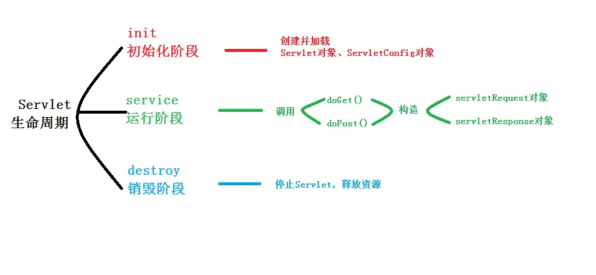

# 题库

## 编程基础

1. 能够将高级语言源程序加工为目标程序的系统软件是（**编译程序**）

   **知识点**：

   * **编译程序**将高级语言源程序加工为目标程序
   * **汇编程序**将目标程序加工为机器码
   * **解释程序**是一种语言处理程序，在词法、语法和语义分析方面与编译程序的工作原理基本相同，但在运行用户程序时，它直接执行程序的内部形式（中间代码）因此，解释程序并不产生目标程序，这是它和编译程序的主要区别
   
2. MIPS用来描述计算机的（**运算速度**）

   **知识点**： MIPS (Million Instructions Per Second)：单字长定点指令平均执行速度 Million Instructions Per Second的缩写
   
3. 带符号的二进制数：

   举例：
   19的补码：00010011
   -19的补码：求绝对值19的真值为00010011，
   然后原码是10010011，
   反码是11101100
   补码是11101101
   


## Java

1. 使用transient修饰的变量不会被序列化

2. Java一律采用Unicode编码方式，每个字符无论中文还是英文字符都占用2个字节

3. Java 8 之后，接口中可以有default或static其中之一修饰的方法，该方法可以实现

4. | 元字符       | 描述                                                         |
   | ------------ | ------------------------------------------------------------ |
   | \            | 将下一个字符标记符、或一个向后引用、或一个八进制转义符。例如，“\\n”匹配\n。“\n”匹配换行符。序列“\\”匹配“\”而“\(”则匹配“(”。即相当于多种编程语言中都有的“转义字符”的概念。 |
   | ^            | 匹配输入字符串的开始位置。如果设置了RegExp对象的Multiline属性，^也匹配“\n”或“\r”之后的位置。 |
   | $            | 匹配输入字符串的结束位置。如果设置了RegExp对象的Multiline属性，$也匹配“\n”或“\r”之前的位置。 |
   | *            | 匹配前面的子表达式任意次。例如，zo*能匹配“z”，也能匹配“zo”以及“zoo”。*等价于o{0,} |
   | +            | 匹配前面的子表达式一次或多次(大于等于1次）。例如，“zo+”能匹配“zo”以及“zoo”，但不能匹配“z”。+等价于{1,}。 |
   | ?            | 匹配前面的子表达式零次或一次。例如，“do(es)?”可以匹配“do”或“does”中的“do”。?等价于{0,1}。 |
   | {n}          | n是一个非负整数。匹配确定的n次。例如，“o{2}”不能匹配“Bob”中的“o”，但是能匹配“food”中的两个o。 |
   | {n,}         | n是一个非负整数。至少匹配n次。例如，“o{2,}”不能匹配“Bob”中的“o”，但能匹配“foooood”中的所有o。“o{1,}”等价于“o+”。“o{0,}”则等价于“o*”。 |
   | {n,m}        | m和n均为非负整数，其中n<=m。最少匹配n次且最多匹配m次。例如，“o{1,3}”将匹配“fooooood”中的前三个o为一组，后三个o为一组。“o{0,1}”等价于“o?”。请注意在逗号和两个数之间不能有空格。 |
   | ?            | 当该字符紧跟在任何一个其他限制符（*,+,?，{n}，{n,}，{n,m}）后面时，匹配模式是非贪婪的。非贪婪模式尽可能少的匹配所搜索的字符串，而默认的贪婪模式则尽可能多的匹配所搜索的字符串。例如，对于字符串“oooo”，“o+”将尽可能多的匹配“o”，得到结果[“oooo”]，而“o+?”将尽可能少的匹配“o”，得到结果 ['o', 'o', 'o', 'o'] |
   | .点          | 匹配除“\r\n”之外的任何单个字符。要匹配包括“\r\n”在内的任何字符，请使用像“[\s\S]”的模式。 |
   | (pattern)    | 匹配pattern并获取这一匹配。所获取的匹配可以从产生的Matches集合得到，在VBScript中使用SubMatches集合，在JScript中则使用$0…$9属性。要匹配圆括号字符，请使用“\(”或“\)”。 |
   | (?:pattern)  | 非获取匹配，匹配pattern但不获取匹配结果，不进行存储供以后使用。这在使用或字符“(\|)”来组合一个模式的各个部分时很有用。例如“industr(?:y\|ies)”就是一个比“industry\|industries”更简略的表达式。 |
   | (?=pattern)  | 非获取匹配，正向肯定预查，在任何匹配pattern的字符串开始处匹配查找字符串，该匹配不需要获取供以后使用。例如，“Windows(?=95\|98\|NT\|2000)”能匹配“Windows2000”中的“Windows”，但不能匹配“Windows3.1”中的“Windows”。预查不消耗字符，也就是说，在一个匹配发生后，在最后一次匹配之后立即开始下一次匹配的搜索，而不是从包含预查的字符之后开始。 |
   | (?!pattern)  | 非获取匹配，正向否定预查，在任何不匹配pattern的字符串开始处匹配查找字符串，该匹配不需要获取供以后使用。例如“Windows(?!95\|98\|NT\|2000)”能匹配“Windows3.1”中的“Windows”，但不能匹配“Windows2000”中的“Windows”。 |
   | (?<=pattern) | 非获取匹配，反向肯定预查，与正向肯定预查类似，只是方向相反。例如，“(?<=95\|98\|NT\|2000)Windows”能匹配“2000Windows”中的“Windows”，但不能匹配“3.1Windows”中的“Windows”。 |
   | (?<!pattern) | 非获取匹配，反向否定预查，与正向否定预查类似，只是方向相反。例如“(?<!95\|98\|NT\|2000)Windows”能匹配“3.1Windows”中的“Windows”，但不能匹配“2000Windows”中的“Windows”。这个地方不正确，有问题此处用或任意一项都不能超过2位，如“(?<!95\|98\|NT\|20)Windows正确，“(?<!95\|980\|NT\|20)Windows 报错，若是单独使用则无限制，如(?<!2000)Windows 正确匹配 |
   | x\|y         | 匹配x或y。例如，“z\|food”能匹配“z”或“food”(此处请谨慎)。“[zf]ood”则匹配“zood”或“food”。 |
   | [xyz]        | 字符集合。匹配所包含的任意一个字符。例如，“[abc]”可以匹配“plain”中的“a”。 |
   | [^xyz]       | 负值字符集合。匹配未包含的任意字符。例如，“[^abc]”可以匹配“plain”中的“plin”。 |
   | [a-z]        | 字符范围。匹配指定范围内的任意字符。例如，“[a-z]”可以匹配“a”到“z”范围内的任意小写字母字符。注意:只有连字符在字符组内部时,并且出现在两个字符之间时,才能表示字符的范围; 如果出字符组的开头,则只能表示连字符本身. |
   | [^a-z]       | 负值字符范围。匹配任何不在指定范围内的任意字符。例如，“[^a-z]”可以匹配任何不在“a”到“z”范围内的任意字符。 |
   | \b           | 匹配一个单词边界，也就是指单词和空格间的位置（即正则表达式的“匹配”有两种概念，一种是匹配字符，一种是匹配位置，这里的\b就是匹配位置的）。例如，“er\b”可以匹配“never”中的“er”，但不能匹配“verb”中的“er”。 |
   | \B           | 匹配非单词边界。“er\B”能匹配“verb”中的“er”，但不能匹配“never”中的“er”。 |
   | \cx          | 匹配由x指明的控制字符。例如，\cM匹配一个Control-M或回车符。x的值必须为A-Z或a-z之一。否则，将c视为一个原义的“c”字符。 |
   | \d           | 匹配一个数字字符。等价于[0-9]。grep 要加上-P，perl正则支持   |
   | \D           | 匹配一个非数字字符。等价于[^0-9]。grep要加上-P，perl正则支持 |
   | \f           | 匹配一个换页符。等价于\x0c和\cL。                            |
   | \n           | 匹配一个换行符。等价于\x0a和\cJ。                            |
   | \r           | 匹配一个回车符。等价于\x0d和\cM。                            |
   | \s           | 匹配任何不可见字符，包括空格、制表符、换页符等等。等价于[ \f\n\r\t\v]。 |
   | \S           | 匹配任何可见字符。等价于[^ \f\n\r\t\v]。                     |
   | \t           | 匹配一个制表符。等价于\x09和\cI。                            |
   | \v           | 匹配一个垂直制表符。等价于\x0b和\cK。                        |
   | \w           | 匹配包括下划线的任何单词字符。类似但不等价于“[A-Za-z0-9_]”，这里的"单词"字符使用Unicode字符集。 |
   | \W           | 匹配任何非单词字符。等价于“[^A-Za-z0-9_]”。                  |

5. 复制的效率System.arraycopy>clone>Arrays.copyOf>for循环

6.  

   is-a，理解为是一个，代表继承关系。 如果A is-a B，那么B就是A的父类。
   like-a，理解为像一个，代表组合关系。 如果A like a B，那么B就是A的接口。
   has-a，理解为有一个，代表从属关系。 如果A has a B，那么B就是A的组成部分。

7. 

```Java
public class Enclosingone {
	//非静态内部类
	public class InsideOne {}
	//静态内部类
	public static class InsideTwo{}
}

class Mytest02{
	public static void main(String args []){
		Enclosingone.InsideOne obj1 = new Enclosingone().new InsideOne();//非静态内部类对象
		Enclosingone.InsideTwo obj2 = new Enclosingone.InsideTwo();//静态内部类对象
	}
}
```

8. 若main（）函数带 参数 ，参数个数最多是（**2**）

```Java
main(int argc, char argv[])
```

9. **Exception（异常）**
   是程序本身可以处理的异常。主要包含RuntimeException等运行时异常和IOException，SQLException等非运行时异常。
   **运行时异常** 包括：都是RuntimeException类及其子类异常，如NullPointerException(空指针异常)、IndexOutOfBoundsException(下标越界异常)等，这些异常是不检查异常，程序中可以选择捕获处理，也可以不处理。这些异常一般是由程序逻辑错误引起的，程序应该从逻辑角度尽可能避免这类异常的发生。
   运行时异常的特点是Java编译器不会检查它，也就是说，当程序中可能出现这类异常，即使没有用try-catch语句捕获它，也没有用throws子句声明抛出它，也会编译通过。
   **非运行时异常（编译异常）** 包括：RuntimeException以外的异常，类型上都属于Exception类及其子类。从程序语法角度讲是必须进行处理的异常，如果不处理，程序就不能编译通过。如IOException、SQLException等以及用户自定义的Exception异常，一般情况下不自定义检查异常
10. **初始化过程：** 
    1. 初始化父类中的静态成员变量和静态代码块；
    2. 初始化子类中的静态成员变量和静态代码块 ； 
    3. 初始化父类的普通成员变量和代码块，再执行父类的构造方法；
    4. 初始化子类的普通成员变量和代码块，再执行子类的构造方法；
11. 四种进程或线程同步互斥的控制方法
    1. 临界区:通过对多线程的串行化来访问公共资源或一段代码，速度快，适合控制数据访问。（就是一个访问公用资源的程序片段）
    2. 互斥量:为协调共同对一个共享资源的单独访问而设计的。
    3. 信号量:为控制一个具有有限数量用户资源而设计。
    4. 事 件:用来通知线程有一些事件已发生，从而启动后继任务的开始。
12. 



13. **JVM运行时数据区分类**：

    * 程序计数器 (Program Counter (PC) Register)
    * JVM栈 (Java Virtual Machine Stacks)
    * 本地方法栈 (Native Method Stacks)
    * 堆内存 (Heap Memory)
    * 方法区 (Method Area)
    * 运行时常量池 (Run-time Constant Pool)

    

    **按线程持有划分**：

    - **单个线程私有**(Managed Per-Thread)：属于这一种的数据区包含<u>程序计数器</u>， <u>JVM栈</u>还有<u>本地方法栈</u>。 每个线程都私有这三个数据区，这些数据区在其所属的线程创建时初始化，并随着所属线程结束被销毁。
    - **多个线程共享**：属于这一种的数据区包含<u>堆内存</u>，<u>方法区</u>和<u>运行时常量池</u>。这些数据区可以被每一个线程访问，他们随着JVM启动而初始化，同时伴随JVM关闭而销毁。

    

    **程序计数器**：

    在通用的计算机体系中，程序计数器用来记录当前正在执行的指令，在JVM中也是如此。程序计数器是线程私有，所以当一个新的线程创建时，程序计数器也会创建。由于Java是支持多线程，Java中的程序计数器用来记录当前线程中正在执行的指令。如果当前正在执行的方法是本地方法，那么此刻程序计数器的值为**undefined**。注意这个区域是唯一一个不抛出OutOfMemoryError的运行时数据区。

    

    **JVM栈**：

    在介绍JVM栈之前，简单介绍一个概念，栈帧：

    > 栈帧
    >
    > 一个栈帧随着一个方法的调用开始而创建，这个方法调用完成而销毁。栈帧内存放者方法中的<u>局部变量</u>，<u>操作数栈</u>等数据。

    JVM栈只对栈帧进行存储，压栈和出栈操作。栈内存的大小可以有两种设置，固定值和根据线程需要动态增长。在JVM栈这个数据区可能会发生抛出两种错误。

    * StackOverflowError 出现在栈内存设置成固定值的时候，当程序执行需要的栈内存超过设定的固定值会抛出这个错误。
    * OutOfMemoryError 出现在栈内存设置成动态增长的时候，当JVM尝试申请的内存大小超过了其可用内存时会抛出这个错误。
    
    
    
    **本地方法栈**
    
    一个支持native方法调用的JVM实现，需要有这样一个数据区，就是本地方法栈，Java官方对于本地方法的定义为`methods written in a language other than the Java programming language`，就是使用非Java语言实现的方法，但是通常我们指的一般为C或者C++，因此这个栈也有着**C栈**这一称号。一个不支持本地方法执行的JVM没有必要实现这个数据区域。本地方法栈基本和JVM栈一样，其大小也是可以设置为固定值或者动态增加，因此也会对应抛出StackOverflowError和OutOfMemoryError错误。
    
    ---
    
    **堆数据区**
    
    堆数据区是用来存放对象和数组（特殊的对象）。堆内存由多个线程共享。堆内存随着JVM启动而创建。众所周知，Java中有一个很好的特性就是<u>自动垃圾回收</u>。垃圾回收就操作这个数据区来回收对象进而释放内存。如果堆内存剩余的内存不足以满足于对象创建，JVM会抛出OutOfMemoryError错误。堆分为：permantspace（持久带）和heap space，heap space分为新生代（一般是一个Eden区，两个Survivor区），老年代（old区）
    
    
    
    **方法区**
    
    在JVM规范中，方法区被视为堆内存的一个逻辑部分。这一点可能由于具体的JVM实现而不同，甚至在方法区不实现垃圾回收处理也是可以的。方法区和堆内存一样被多个线程访问，方法区中存放类的信息，比如<u>类加载器引用</u>，<u>属性</u>，<u>方法代码</u>和<u>构造方法</u>和<u>常量</u>等。当方法区的可用内存无法满足内存分配需求时，JVM会抛出OutOfMemoryError错误。
    
    
    
    **运行时常量池**
    
    <u>运行时常量池创建在方法区</u>，当一个类或者一个接口被创建的时候，JVM会创建一个运行时常量池。一个运行时常量池实际上是一个类或者接口的class文件中常量池表（constant_pool table）的运行时展示形式。一个运行时常量池包含了多种类型的常量，从诸如运行时可以确定的数值型字面量到运行时才能决定的方法和属性引用。当运行时常量池无法满足于内存分配需求时，JVM会抛出OutOfMemoryError错误。
    
    
    
14. 类中声明的变量有默认初始值；方法中声明的变量没有默认初始值，必须在定义时初始化，否则在访问该变量时会出错。

15. forward，服务器获取跳转页面内容传给用户，用户地址栏不变

    redirect，是服务器向用户发送转向的地址，redirect后地址栏变成新的地址

16. Spring 框架是一个分层架构，由 7 个定义良好的模块组成。

    核心容器，Spring上下文，Spring AOP， Spring DAO， Spring ORM， Spring Web， Spring MVC。

17. return i++, 先返回i，然后i+1

18. synchronized保证三大性，原子性，有序性，可见性，volatile保证有序性，可见性，不能保证原子性

19. 外部类只能有两种访问控制级别： public 和默认

20. 内部类的上一级程序单元是外部类，它具有 4 个作用域：同一个类（ private ）、同一个包（ protected ）和任何位置（ public ）

21. 因为局部成员的作用域是所在方法，其他程序单元永远不可能访问另一个方法中的局部变量，所以<u>所有的局部成员</u>都不能使用访问控制修饰符修饰

22. volatile只保证线程在“加载数据阶段”加载的数据是最新的，并不能保证线程安全

23. 


24. 三元操作符如果遇到可以转换为数字的类型，会做自动类型提升。

    比如

    ```java
Object o1 = (false) ? new Double(1.0) : new Integer(2);
    System.out.println(o1);
    ```
    
    会打印2.0
    
25. MVC全名是Model View Controller，是模型(model)－视图(view)－控制器(controller)的缩写，一种软件设计典范，用一种业务逻辑、数据、界面

    显示分离的方法组织代码，将业务逻辑聚集到一个部件里面，在改进和个性化定制界面及用户交互的同时，不需要重新编写业务逻辑。MVC被独特的发展起来用于映射传统的输入、处理和输出功能在一个逻辑的图形化用户界面的结构中。 

    MVC只是将分管不同功能的逻辑代码进行了隔离，增强了可维护和可扩展性，增强代码复用性，因此可以减少代码重复。但是不保证减少代码量，多层次的调用模式还有可能增加代码量

26. CountDownLatch: **一个线程**(或者多个)， 等待另外**N个线程**完成**某个事情**之后才能执行。 

    CyclicBarrier: **N个线程**相互等待，任何一个线程完成之前，所有的线程都必须等待。

    这样应该就清楚一点了，对于CountDownLatch来说，重点是那个**“一个线程”**, 是它在等待， 而另外那N的线程在把**“某个事情”**做完之后可以继续等待，可以终止。而对于CyclicBarrier来说，重点是那**N个线程**，他们之间任何一个没有完成，所有的线程都必须等待。

    

    CountDownLatch 是计数器, 线程完成一个就记一个, 就像 报数一样, 只不过是递减的.

    而CyclicBarrier更像一个水闸, 线程执行就想水流, 在水闸处都会堵住, 等到水满(线程到齐)了, 才开始泄流。

27. Web service顾名思义是基于web的服务，它是一种跨平台，跨语言的服务。

    我们可以这样理解它，比如说我们可以调用互联网上查询天气信息的web服务，把它嵌入到我们的B/S程序中，当用户从我们的网点看到天气信息时，会认为我们为他提供很多的服务，但其实我们什么也没做，只是简单的调用了一下服务器上的一端代码而已。Web service 可以将你的服务发布到互联网上让别人去调用，也可以调用别人发布的web service，和使用自己的代码一样。

    它是采用XML传输格式化的数据，它的通信协议是SOAP(简单对象访问协议).

28. String对象的两种创建方式:
    第一种方式: String str1 = "aaa"; 是在常量池中获取对象("aaa" 属于字符串字面量，因此编译时期会在常量池中创建一个字符串对象)，

    第二种方式: String str2 = new String("aaa") ; 一共会创建两个字符串对象一个在堆中，一个在常量池中（前提是常量池中还没有 "aaa" 字符串对象）

29. 标识符就是变量的意思

30. -n = ~n + 1 -> ~n = -n - 1

31. -Xmx：最大堆大小

    -Xms：初始堆大小

    -Xmn:年轻代大小

    -XXSurvivorRatio：年轻代中Eden区与Survivor区的大小比值

32. getParameter()是获取POST/GET传递的参数值；
    getInitParameter获取Tomcat的server.xml中设置Context的初始化参数

    getAttribute()是获取对象容器中的数据值；
    getRequestDispatcher是请求转发

33. switch支持 int及以下（char， short， byte），String， Enum

34. 强制类型转换的优先级高于+ - * /

35. **四种引用类型**

    JDK1.2 之前，一个对象只有“已被引用”和"未被引用"两种状态，这将无法描述某些特殊情况下的对象，比如，当内存充足时需要保留，而内存紧张时才需要被抛弃的一类对象。

    所以在 JDK.1.2 之后，Java 对引用的概念进行了扩充，将引用分为了：强引用（Strong Reference）、软引用（Soft Reference）、弱引用（Weak Reference）、虚引用（Phantom Reference）4 种，这 4 种引用的强度依次减弱。

    **一，强引用**

    Object obj = new Object(); //只要obj还指向Object对象，Object对象就不会被回收 obj = null; //手动置null

    只要强引用存在，垃圾回收器将永远不会回收被引用的对象，哪怕内存不足时，JVM也会直接抛出OutOfMemoryError，不会去回收。如果想中断强引用与对象之间的联系，可以显示的将强引用赋值为null，这样一来，JVM就可以适时的回收对象了

    **二，软引用**

    软引用是用来描述一些非必需但仍有用的对象。**在内存足够的时候，软引用对象不会被回收，只有在内存不足时，系统则会回收软引用对象，如果回收了软引用对象之后仍然没有足够的内存，才会抛出内存溢出异常**。这种特性常常被用来实现缓存技术，比如网页缓存，图片缓存等。

    在 JDK1.2 之后，用java.lang.ref.SoftReference类来表示软引用。

    **三，弱引用**

    弱引用的引用强度比软引用要更弱一些，**无论内存是否足够，只要 JVM 开始进行垃圾回收，那些被弱引用关联的对象都会被回收**。在 JDK1.2 之后，用 java.lang.ref.WeakReference 来表示弱引用。

    **四，虚引用**

    虚引用是最弱的一种引用关系，如果一个对象仅持有虚引用，那么它就和没有任何引用一样，它随时可能会被回收，在 JDK1.2 之后，用 PhantomReference 类来表示，通过查看这个类的源码，发现它只有一个构造函数和一个 get() 方法，而且它的 get() 方法仅仅是返回一个null，也就是说将永远无法通过虚引用来获取对象，虚引用必须要和 ReferenceQueue 引用队列一起使用。

36. count = count++ 原理是 temp = count； count = count+1 ； count = temp；

37. 


38. Math.cos为计算弧度的余弦值，Math.toRadians函数讲角度转换为弧度


## 网络基础

1. TCP/IP模型的互联网层对应于OSI模型的网络层

   **知识点**：

|   TCP/IP   |         OSI          |
| :--------: | :------------------: |
|   应用层   | 应用层/表示层/会话层 |
|   传输层   |        传输层        |
|   网络层   |        网络层        |
| 网络接口层 |  数据链路层、物理层  |

2. 计算机网络建立的主要目的是实现计算机资源的共享。计算机资源主要指计算机（**硬件、软件与数据**）。 软件与数据库 服务器、工作站与软件 硬件、软件与数据 通信子网与资源子网

3. IP地址分类：

   IP地址是一个32位的二进制数，通常被分割为**4**个字段，每个字段是一个字节，即**4**个字节、 每个字节有**8**位，最大值是**255**($2^8$=256：0~255)。

   IP地址=网络地址+主机地址

   **按照起始字符的不同，IP地址可以分为A、B、C、D、E类地址**

   A类地址：0（开头）+7位（网络地址）+24位（主机地址）

   B类地址：10（开头）+14位（网络地址）+16位（主机地址）

   C类地址：110（开头）+21位（网络地址）+8位（主机地址）

   D类 以1110开始 用于组播 不分网络地址和主机地址

   E类 以11110开始 用于科研保留 不分网络地址和主机地址

   范围上划分有些要注意的：

   A类 从1.0.0.1 到126.255.255.254

   B类 从128.0.0.1到191.255.255.254

   C类 从192.0.0.1到223.255.255.254

   D类 从224.0.0.1到239.255.255.254

   其中127.x.x.x段地址空间是被保留的回环地址

   **X.255.255.255是当前网络的广播地址，不用做设备地址使用，所以都到254**。

4. 在TCP/IP协议体系中，将网络结构自上而下划分为四层，即应用层、传输层、网络层、网络接口，工作时（**发送方从上层向下层传输数据，每经过一层附加协议控制信息**）

   **知识点**：

   数据发送是自上向下的，层层加码；

   数据接收是自下向上的，层层解码。
   
5. IP地址/数字，表示前（数字）位不变。

   **例**：10.174.20.176/28表示前28位不变，该网段的有效IP地址为：10.174.20.1011 0000~10.174.20.1011 1111，排出全0和全1不能用，则IP为：10.174.20.177~10.174.20.190（去掉.176和.191）.


## 操作系统

1. 若有3 个进程共享一个互斥段每次最多允许2 个进程进入互斥段，则信号量的变化范围是（2，1，0，-1）

   **知识点**：在有 **n** 个进程共享一个互斥段，如果最多允许 **m** 个进程 (*m*<*n*) 同时进入互斥段，则信号量的变化范围是  -(n-m) 到 m
   
   信号量为**正**代表当前可用资源的数量
   
   信号量为**负**，其<u>绝对值</u>表示等待使用该资源的进程数


## 数据库

1. 要保证数据库物理数据独立性，需要修改的是（**模式/内模式映射**）

   **知识点**：

   数据库三级模式体系结构的划分，有利于保持数据库的**数据独立性**（物理独立性）。

   * 数据独立性是指用户的应用程序与储存在磁盘上的数据库中数据是相互独立的。当数据的物理储存变了，应用程序不会变
   
   外模式/模式的映像保证**逻辑独立性**，模式/内模式的映像则保证**物理独立性**。
   
   * 逻辑独立性是指用户的应用程序与数据库的逻辑结构是相互独立的。当数据的逻辑结构改变时，用户程序也可以不变。
   
   （https://www.modb.pro/db/14558）
   
2. 关系数据库中的关键字是指（**能唯一标识元组的属性或属性集合**）

   **知识点**：指**Primary key**

3. 逻辑数据独立性是指修改（**模式保持外模式不变**）

   **知识点**：

   逻辑独立性是外模式不变，模式改变时，如增加新的关系，新的属性，改变属性的数据类型，由数据库管理员对各个<u>外模式/模式</u>的映像做相应改变，可以使得外模式不变，因为应用程序依据外模式编写的，所以外模式不变，应用程序也不变，即保证了逻辑独立

   物理独立性是模式不变，内模式改变，如数据库存储结构发生改变，选用另一种数据结构，由数据库管理员对各个<u>模式/内模式</u>的映像做相应改变，可以使得模式不变 ，从而保证了应用程序也不变

4. 数据库事务四个特性及实现其的子系统:

   **知识点**：

   **原子性**:针对整个[事务](https://link.jianshu.com?t=http://51code.com/)中所有执行的操作，要么全部完成，要么全部不完成，不可能停在中间某个环节。如果事务在执行过程中发生了错误，会被回滚（Rollback）到事务开始前的状态，如同这个事务从来没有执行过。（<u>由DBMS的事务管理子系统来实现</u>）

   **一致性**:在事务开始前和结束后，数据库的完整性约束没有被破坏（<u>由DBMS的完整性子系统执行测试任务</u>）。

   **隔离性**:隔离状态执行事务，使它们好像是[系统](https://link.jianshu.com?t=http://www.2cto.com/os/)在给定时间内执行的唯一[操作](https://link.jianshu.com?t=http://51code.com/)。如果有两个事务，运行在相同的时间内，执行相同的功能，事务的隔离性将确保每一事务在系统中认为只有该事务在使用系统。这种属性有时称为串行化，为了防止事务操作间的混淆，必须串行化或序列化请求，使得在同一时间仅有一个请求用于同一数据（<u>由DBMS的并发控制子系统实现</u>）。

   **持久性**:在事务完成以后，该事务所对数据库所作的更改便持久的保存在数据库之中，并不会被回滚（<u>由DBMS的恢复管理子系统实现的</u>）。
   
5. **共享锁（Share locks简记为S锁）**：也称读锁，事务A对对象T加s锁，其他事务也只能对T加S，多个事务可以同时读，但不能有写操作，直到A释放S锁。

   **排它锁（Exclusive locks简记为X锁）**：也称写锁，事务A对对象T加X锁以后，其他事务不能对T加任何锁，只有事务A可以读写对象T直到A释放X锁。

6. 每个block最多存放一个文件

7. 数据库中造成数据不一致的原因主要有：

   - **数据冗余**：如果数据库中存在冗余数据，比如两张表中都存储了用户的地址，在用户的地址发生改变时，如果只更新了一张表中的数据，那么这两张表中就有了不一致的数据。
   - **并发控制不当**：比如某个订票系统中，两个用户在同一时间订同一张票，如果并发控制不当，可能会导致一张票被两个用户预订的情况。当然这也与元数据的设计有关。
   - **故障和错误**：如果软硬件发生故障造成数据丢失等情况，也可能引起数据不一致的情况。因此我们需要提供数据库维护和数据恢复的一些措施。
8. 数据库是共享资源，通常有许多个事务同时在运行。当多个事务并发地存取数据库时就会产生同时读取和／或修改同一数据的情况。若对并发操作不加控制就可能会存取和存储不正确的数据，破坏数据库的一致性。所以数据库管理系统必须提供并发控制机制。最常用的技术是**封锁技术**。

9. 丢失修改：原本两个事务的目的是T1先把A的值加10，A变为58。然后T2把A的值再减2，即A变成56。但是根据题目中的执行顺序，A的值变为48-2=46，即T2的修改覆盖了T1的修改，这种现象叫做丢失修改。

   不可重复读：不可重复读是指事务T1读取数据后，事务T2执行更新操作，使T1无法再现前一次读取结果。

   读"脏"数据：读"脏"数据是指事务T1修改某一数据，并将其写回磁盘，事务T2读取同一数据后，T1由于某种原因被撤消，这时T1已修改过的数据恢复原值，T2读到的数据就与数据库中的数据不一致，则T2读到的数据就为"脏"数据，即不正确的数据。

10. **触发器**是定义在关系表上的由事件驱动的特殊过程

11. 视图的作用：

    * **简单性**：看到的就是需要的。视图不仅可以简化用户对数据的理解，也可以简化他们的操作。那些被经常使用的查询可以被定义为视图，从而使得用户不必为以后的操作每次指定全部的条件。
    * **安全性**：通过视图用户只能查询和修改他们所能见到的数据。数据库中的其它数据则既看不见也取不到。数据库授权命令可以使每个用户对数据库的检索限制到特定的数据库对象上，但不能授权到数据库特定行和特定的列上。通过视图，用户可以被限制在数据的不同子集上：使用权限可被限制在另一视图的一个子集上，或是一些视图和基表合并后的子集上。
    * **逻辑数据独立性**：视图可帮助用户屏蔽真实表结构变化带来的影响。

    视图是一个虚拟表，其内容是查询定义。同真实的表一样，视图包含一系列带有名称的列和行数据。但是，视图并不在数据库中以存储的数据值集形式存在。行和列数据来自由定义视图的查询所引用的表，并且在引用视图时动态生成。对其中所引用的基础表来说，视图的作用类似于筛选。定义视图的筛选可以来自当前或其它数据库的一个或多个表，或者其它视图。分布式查询也可用于定义使用多个异类源数据的视图。

12. 考察组合索引的知识。有一个最左优先的原则，组合索引(a, b, c)，会建立三个索引, (a), (a, b), (a, b, c)。

    在查询语句中，

    1. where a = xxx 
    2. 或者 where a = xxx and b = yyy
    3. 或者where a = xxx and b = yyy and c = zzz
    4. 或者 where b = yyy and c = zzz and a = xxx

    都可以使用索引。第4种中情况可以优化成第3种。

    不包含a的情况，则用不到索引。例如where b = yyy and c = zzz

    （*带头大哥不能死，中间兄弟不能断！*）


## 编译和体系结构

1. （**2级：运输单元**）采用无源 RFID 标签或条形码（？？？）


## 数据结构

1. 稀疏矩阵三元组表储存方法

   **知识点**：

   * **稀疏矩阵**：大多数元素为零元素的矩阵
   * **三元组线性表存储结构**：用一个三元组（tuple3）存放矩阵中的一个非零元素的行号，列号和该非零元素：(i, j, e)。一般情况下，一个稀疏矩阵有若干个非零元素，所以用一个“三元组线性表”来存放一个稀疏矩阵。
   
2. 判断一个单向链表中是否存在环的最佳方法是（**快慢指针**）

3. 二叉树中，度为2的结点数量为叶结点数量减1

4. 二叉树中，结点数量 = 总度数 + 1

5. B树的关键字范围为[m/2]-1<=n<=m-1

6. 由森林转换的二叉树中，根结点即为第一棵树的根结点，<u>根结点的左子树</u>是由第一棵树中除了根结点以外其余结点组成的，<u>根结点的右子树</u>是由森林中除第一棵树外其他树转换来的。


## 算法

1. 拓扑排序算法主要是循环执行以下两步，直到不存在入度为0的顶点为止。

   (1) 选择一个入度为0的顶点并输出之；

   (2) 从网中删除此顶点及所有[出边](http://baike.baidu.com/item/出边)。

2. 

3. 汉诺塔：汉诺塔（又称河内塔）问题是源于印度一个古老传说的益智玩具。大梵天创造世界的时候做了三根金刚石柱子，在一根柱子上从下往上按照大小顺序摞着64片黄金圆盘。大梵天命令婆罗门把圆盘从下面开始按大小顺序重新摆放在另一根柱子上。并且规定，在小圆盘上不能放大圆盘，在三根柱子之间一次只能移动一个圆盘。

   设移动n个盘子的汉诺塔问题需要g(n)次移动操作来完成。由展示移动过程算法可知g(n)应是三部分之和。
   (1) 将n个盘上面的n-1个盘子借助C桩从A桩移到B桩上，需g(n-1)次移动；
   (2) 然后将A桩上第n个盘子移到C桩上（1次）；
   (3) 最后，将B桩上的n-1个盘子借助A桩移到C桩上，需g(n-1)次。
   因而有递归关系：
   g(n)=2*g(n-1)+1
   初始条件(递归出口)：
   g(1)=1
   即 1、3、7、15、31。。。即g(n) = 2^n -1 